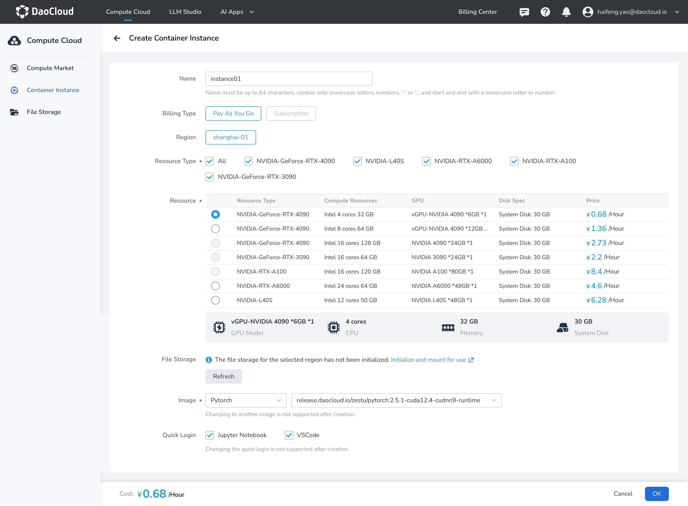

---
hide:
  - toc
---

# Create Container Instance

Container instances are commonly used for algorithm development and inference.
Various GPU types can be selected during creation to flexibly match computing requirements.
Instances automatically associate with file storage for easier data management.
They support using system-built images for rapid environment deployment and allow
convenient development and access through tools like Jupyter Notebook, VSCode, and SSH,
aiding in efficient algorithm research and inference tasks.

## Prerequisites

- Log in to your d.run account
- Account balance must be greater than or equal to the unit price of the selected resource type

## Steps

1. Log in to d.run, which defaults to the **Compute Market** .
   You can choose the required GPU type and click **Buy Now** ; 
   or switch to **Container Instances** and click the **Create** button to create a new instance.

2. Fill in the basic information according to the requirements below and click **OK**

    

    | Name | Description |
    |------|------------- |
    | Optional | Up to 64 characters, can only include lowercase letters, numbers, separators ("-"), and dots ("."). Must start and end with a lowercase letter or number. |
    | Billing Type | - Pay-as-you-go: Cost = Duration * Unit Price. Duration = Shutdown Time - Startup Time, accurate to the second; no charges during startup or waiting periods. Hourly billing is supported; if usage is less than an hour, charges will be based on actual usage time, accurate to the second.   - Annual and Monthly Packages: Annual and monthly packages will soon be supported, with more favorable pricing for single cards. Stay tuned. |
    | Region | It is recommended to choose a region close to your location to create instances and initialize file storage for faster upload and download speeds. |
    | Resource Type | GPU model |
    | Resource | Supports full GPU and vGPU resources; select based on demand. |
    | File Storage | After initializing file storage, it will be automatically mounted to the instance, with the default mount path being: /root/zestu-data |
    | Image | Supports Pytorch and TensorFlow; more system images and custom images will be supported in the future, stay tuned. |
    | Quick Login | You can choose to access the container instance via Jupyter Notebook and VSCode. If unchecked, related components will not be installed, and access tools cannot be changed after creation. |
  
3. Click **OK** to complete the instance creation.

!!! note

    - No charges will be incurred while the container is in a starting, queuing, shut down, or deleting state; normal charges apply only when it is running or shut down.
    - The unit price for on-demand billed resources is the cost incurred for running that instance per hour; if actual usage is less than an hour, charges will be based on actual usage time, accurate to the second.
