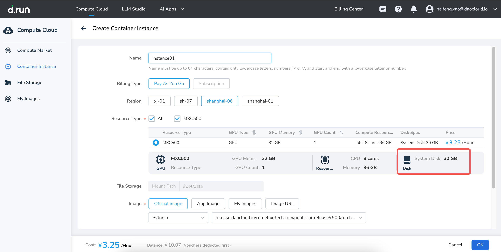

# Disk Storage

Disk storage provides the foundational storage for container instances and is divided into **system disks** and **data disks**.

## System Disk

The system disk serves as the container's root filesystem (rootfs). d.run provides each container instance with **30 GB of free system disk space**. Key features include:

- **Basic Functionality**: The system disk can be saved as an image. For details, see [Save Image](../myimages/image-save.md). After a restart, the container will use the saved image.
- **Advanced Functionality**: Developer instance system disks offer persistent storage. Data and environment settings are preserved even after shutdown or reboot. Once a developer instance is deleted, the system disk storage will be cleared. (Contact your administrator if you wish to use this feature.)

## Data Disk

The data disk is a persistent storage solution based on distributed block storage. Each instance receives **50 GB of free data disk space**. Upon creation, the data disk is automatically mounted at `/root/tmp` and is tightly coupled to the lifecycle of the instance—it is created and deleted along with the instance. Data disks can be expanded with paid plans but **cannot be shared between instances**.

### Data Disk Expansion

By default, the data disk can be expanded up to **200 GB**. For larger quotas, contact **400-002-6898**. Note that:

- Disk expansion is **irreversible**; you cannot shrink the disk after increasing its size.  
- Billing continues even if the instance is shut down.

After a container instance is created, you can **upgrade the data disk multiple times** through the **Change Configuration** feature.
