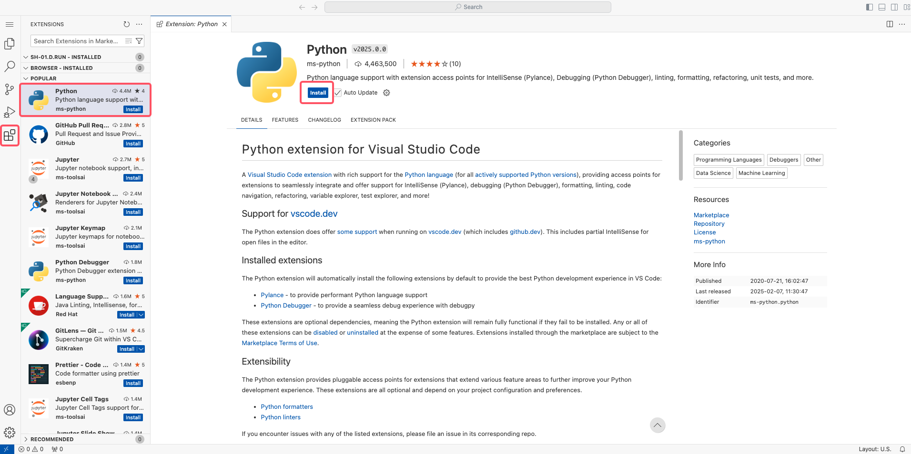
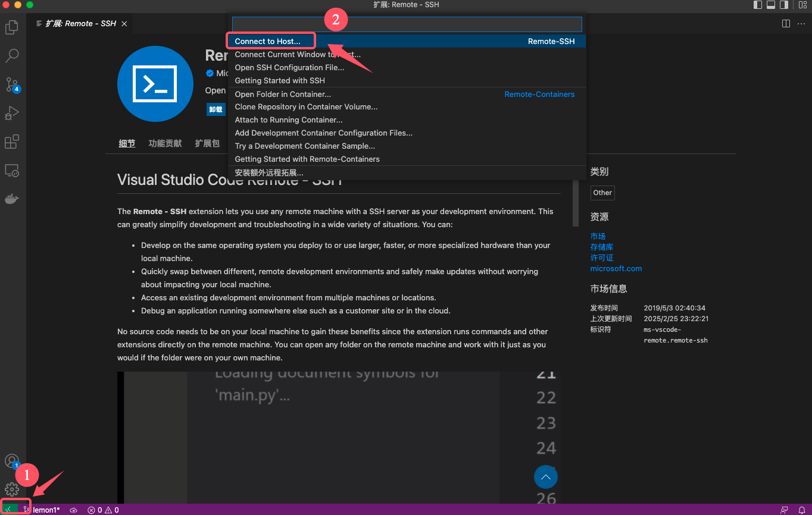
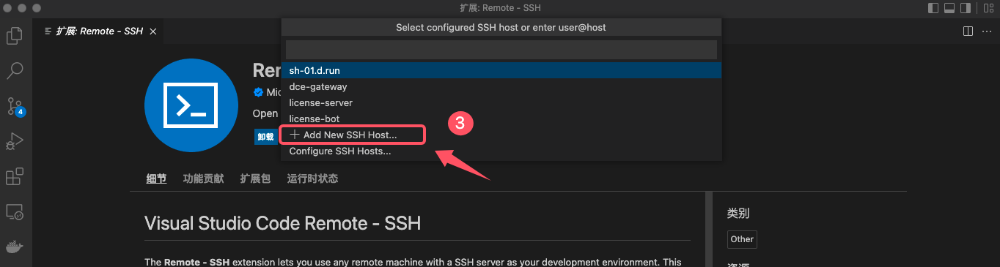
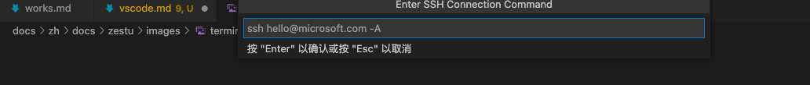

# VSCode

**VSCode** (Visual Studio Code) is a cross-platform code editor developed by Microsoft. It's free, open-source, and supports a rich ecosystem of extensions.  
On the d.run platform, you can either use the cloud-based version of VSCode or connect to remote container instances using the **Remote-SSH** plugin from your local VSCode.

## Using VSCode on d.run

1. When creating a container instance, ensure that the **VSCode** access tool is selected (it's checked by default).

    <!--  -->

2. Once the container starts, click the quick access link in the container instance list to open VSCode.

    <!--  -->

3. Inside the VSCode UI, click **Toggle Panel** in the upper right to open the Terminal panel at the bottom. You can run terminal commands here.  
   Use the sidebar on the left to create files or perform other actions.

    

4. To install extensions, click **Extensions** in the left sidebar to open the extension marketplace.  
   Find and install the extension you need (e.g., the Python extension), then click **Install** on the detail page.

    

## Using Local VSCode with Remote-SSH

1. Configure the Remote-SSH plugin in your local VSCode.

    !!! note

        If Remote-SSH is already installed, you can skip this step and go directly to [Step 2](#2-ssh-connect-to-your-instance).

    Open the **Extensions** panel in your local VSCode, search for `Remote-SSH`, and install it.

    

2. **SSH connect to your d.run container instance**

    Follow the steps ① → ② → ③ to add a new SSH host.

    

    

3. Get your instance's SSH login information from the platform.

    

4. For example, use the command: `ssh root@sh-01.d.run -p 30817`, then press **Enter**.

    

    Choose the first option to save the host info in your local SSH config file.

    

5. Connect to the remote host

    Once added, the new host will appear in the **Remote Explorer** panel. Click the button to open a new window and initiate the remote connection.

    

6. Copy your instance login password (refer to [Step 3](#3-get-your-instance-login-info)), paste it when prompted, and press **Enter**.

    

7. After successful connection, the **Explorer** tab will show the remote file system, and the bottom-left corner will display the connected host name.

    
