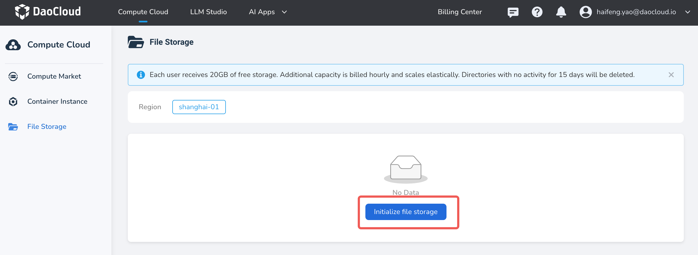
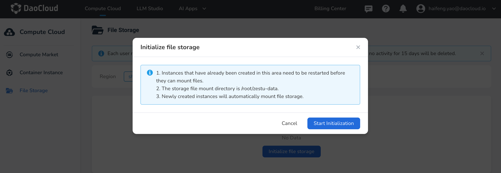
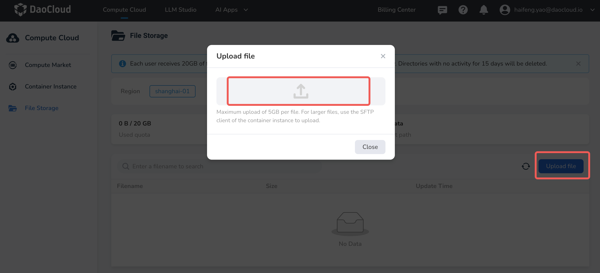
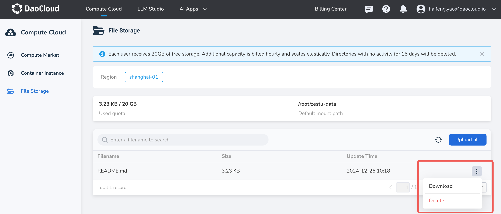

---
hide:
  - toc
---

# File Storage

File storage is primarily used to store data, source code, and other files. Important files can be regularly uploaded to file storage.

!!! note

    d.run provides each user with 20GB of free space, and elastic scaling will soon be supported. Stay tuned.

## Prerequisites

- Log in to your platform account

## Steps to Operate

1. Log in to d.run, go to **Compute Cloud** -> **File Storage**, select a nearby region,
   and click **Initialize file storage** to start the initialization.

    

    

2. Upload Files: Click **Upload File** and select local files to upload.
  
    

3. Download Files: Select the file you want to download, click the **...**
   on the right side of the list, and choose **Download** from the dropdown menu.
  
    

4. Delete Files: Select the file you want to delete, click the **...** on the right side of the list,
   and choose **Delete** from the dropdown menu. Deleted files cannot be recovered,
   so please proceed with caution!
