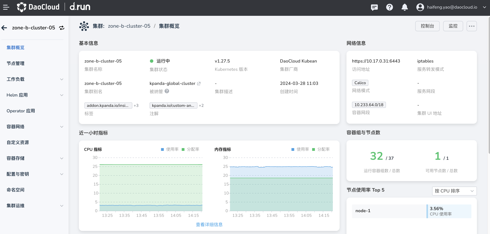

---
hide:
  - toc
---

# 算力集群

购买算力之后，可用的集群将显示在集群列表中。

!!! tip

    集群（Cluster）指容器运行所需要的云资源组合，关联了若干服务器节点，在这些节点上运行容器化应用，每个集群至少有一个工作节点。
    容器平台可自建集群并进行集群全生命周期管理，以及纳管各云原生厂商任意符合一定版本要求的 Kubernetes 集群。

集群列表显示了集群的一些基本信息，点击集群名称。

进入 **集群概览** 页面，您可以通过左侧导航栏管理节点、工作负载、Helm 应用等等。

容器管理是基于 Kubernetes 构建的面向云原生应用的容器化管理模块。
它基于原生多集群架构，解耦底层基础设施，实现多云与多集群统一化管理，大幅简化企业的应用上云流程，
有效降低运维管理和人力成本。通过容器管理，您可以便捷创建 Kubernetes 集群，快速搭建企业级的容器云管理平台。

!!! tip

    容器化是 AI 数据中心发展的不可或缺的趋势，它是应用封装、部署和托管的自然延伸。

- :material-server:{ .lg .middle } __集群管理__

    ---

    容器管理目前支持四种集群：全局服务集群、管理集群、工作集群、接入集群。

    - [升级集群](../user-guide/clusters/upgrade-cluster.md)
    - [集群角色](../user-guide/clusters/cluster-role.md)
    - [集群状态](../user-guide/clusters/cluster-status.md)

- :fontawesome-brands-node:{ .lg .middle } __节点管理__

    ---

    节点上运行了 kubelet、容器运行时以及 kube-proxy 等组件。

    - [节点调度](../user-guide/nodes/schedule.md)
    - [标签与注解](../user-guide/nodes/labels-annotations.md)，[污点管理](../user-guide/nodes/taints.md)
    - 节点[扩容](../user-guide/nodes/add-node.md)/[缩容](../user-guide/nodes/delete-node.md)
    - [节点认证](../user-guide/nodes/node-authentication.md)、[节点可用性检查](../user-guide/nodes/node-check.md)

- :simple-myspace:{ .lg .middle } __命名空间__

    ---

    命名空间是构建虚拟空间隔离物理资源的一种方式，仅作用于带有命名空间的对象。

    - [创建/删除命名空间](../user-guide/namespaces/createns.md)
    - [命名空间独享节点](../user-guide/namespaces/exclusive.md)
    - [为命名空间配置 Pod 安全策略](../user-guide/namespaces/podsecurity.md)

- :octicons-tasklist-16:{ .lg .middle } __工作负载__

    ---

    工作负载是指运行的各类应用程序。

    - 创建 [Deployment](../user-guide/workloads/create-deployment.md) 和 [StatefulSet](../user-guide/workloads/create-statefulset.md)
    - 创建 [DaemonSet](../user-guide/workloads/create-daemonset.md)
    - 创建 [Job](../user-guide/workloads/create-job.md) 和 [CronJob](../user-guide/workloads/create-cronjob.md)

- :material-expand-all:{ .lg .middle } __弹性伸缩__

    ---

    通过配置 HPA、VPA 策略实现工作负载的弹性伸缩。

    - 安装 [metrics-server](../user-guide/scale/install-metrics-server.md)、[kubernetes-cronhpa-controller](../user-guide/scale/install-cronhpa.md) 和 [VPA](../user-guide/scale/install-vpa.md) 插件
    - [创建 HPA 策略](../user-guide/scale/create-hpa.md)
    - [创建 VPA 策略](../user-guide/scale/create-vpa.md)

- :simple-helm:{ .lg .middle } __Helm 应用__

    ---

    Helm 是一种包管理工具，提供了数百个 Helm 模板，方便用户快速部署应用。

    - [Helm 模板](../user-guide/helm/README.md)
    - [Helm 应用](../user-guide/helm/helm-app.md)
    - [Helm 仓库](../user-guide/helm/helm-repo.md)

- :material-dot-net:{ .lg .middle } __容器网络__

    ---

    容器网络通过 Ingress 定义路由规则，根据网络策略控制流量，对外提供服务。

    - [服务 Service](../user-guide/network/create-services.md)：ClusterIP、NodePort、LoadBalancer
    - [路由 Ingress](../user-guide/network/create-ingress.md)
    - [网络策略 NetworkPolicy](../user-guide/network/network-policy.md)

- :material-harddisk:{ .lg .middle } __容器存储__

    ---

    容器管理奉行 Kubernetes 的容器化存储理念，支持原生 CSI，能够制备动态卷、卷快照、克隆等。

    - [数据卷声明 PVC](../user-guide/storage/pvc.md)
    - [数据卷 Volume](../user-guide/storage/pv.md)
    - [存储池 StorageClass](../user-guide/storage/sc.md)

- :material-key:{ .lg .middle } __配置与密钥__

    ---

    容器管理支持以键值对的形式管理 ConfigMap 和 Secret：

    - [配置项 ConfigMap](../user-guide/configmaps-secrets/create-configmap.md)
    - [密钥 Secret](../user-guide/configmaps-secrets/create-secret.md)

- :material-auto-fix:{ .lg .middle } __集群运维__
    
    ---

    集群运维指的是查看集群的操作、升级集群以及集群配置等。

    - [查看最近操作记录](../user-guide/clusterops/latest-operations.md)
    - [集群设置](../user-guide/clusterops/cluster-settings.md)
    - [集群升级](../user-guide/clusters/upgrade-cluster.md)

!!! success

    通过容器化，您可以更快速、简单地开发和部署 AI 应用程序，比构建虚拟设备更加高效。
    容器化架构带来了令人瞩目的运维和经济效益，包括更低的许可成本、更高的物理资源利用率、更好的可扩展性以及更高的服务可靠性。

    展望未来，容器虚拟化将帮助企业更好地利用混合云和多云环境，实现更优化的资源管理和应用部署。
