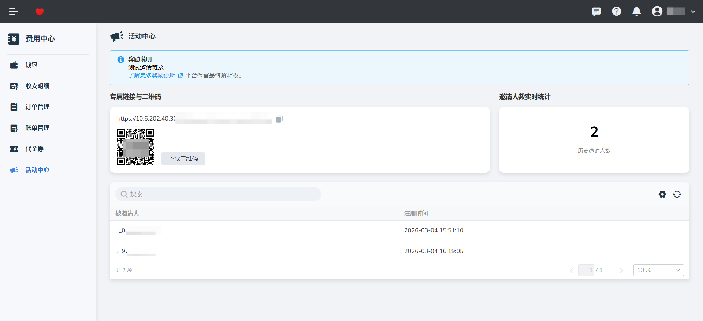
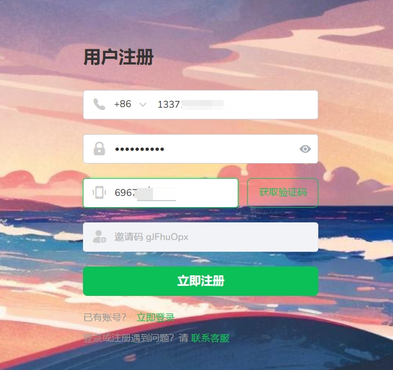

## 活动中心

**活动中心** 是 d.run 平台为用户提供的激励与互动空间。通过邀请机制，用户可以邀请好友加入平台，并实时掌握邀请进度与奖励发放情况。

### 1. 初始化邀请功能

首次使用邀请功能前，需先激活个人专属标识。

* **操作路径**：登录账户后，进入 **费用中心** > **活动中心**。
* **功能说明**：若您的邀请功能尚未激活，系统将显示初始化提示。
* **初始化提示**：
> 您的邀请功能尚未初始化，邀请码还未生成。请点击下方按钮进行初始化；初始化成功后，您将获取到专属邀请链接和二维码。

* **结果**：点击“初始化邀请码”后，系统将立即生成唯一的邀请标识，并展示相应的推广链接与二维码图形。

---

### 2. 邀请新用户

您可以利用生成的专属工具进行推广。

* **邀请方式**：
* **专属链接**：复制链接并发送给好友。
* **二维码**：保存二维码图片，好友通过手机扫描即可跳转注册。
* **注册流程**：被邀请人通过该特定链接或二维码完成注册后，系统将自动建立关联关系，作为后续代金券或其他奖励的发放依据。

### 3. 邀请记录与统计

平台为您提供透明的数据看板，方便实时查看推广效果。

* **实时统计**：在活动中心页面顶部，可直观查看当前 **累计邀请人数** 。
* **邀请列表**：页面下方设有详细的被邀请人信息表，包含以下内容：
* **被邀请人账号**：显示脱敏后的注册账号/用户名。
* **注册时间**：精确记录好友完成注册的具体时点。
* **搜索功能**：支持通过账号关键字进行搜索，快速定位特定的被邀请记录。

### 4. 奖励发放（关联代金券）

符合活动规则的有效邀请，系统将根据当前活动配置自动发放奖励。

* **发放规则**：当被邀请人完成指定任务（如注册成功或首次充值）后，系统将自动向发起邀请的用户发放 **代金券** 。
* **查看方式**：获赠的代金券将自动同步至您的 **代金券列表** 中，您可以按照前述“使用规则”进行消费抵扣。

