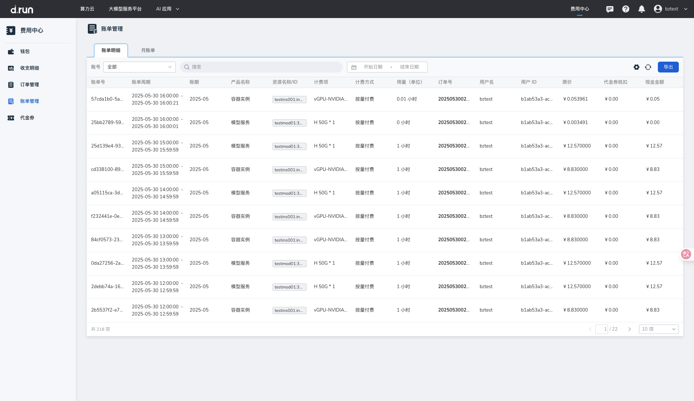
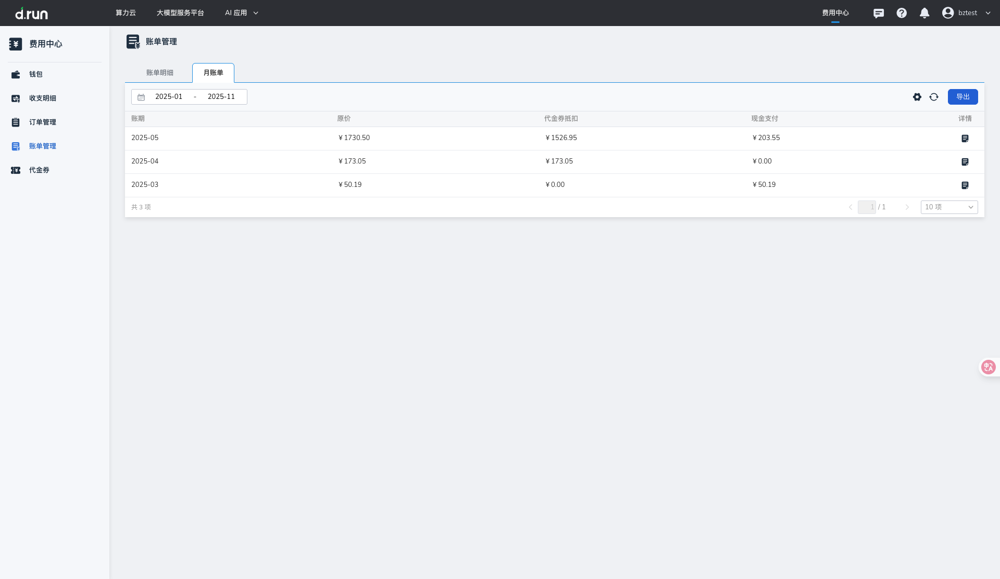

---
hide:
  - toc
---

# 账单管理

**账单管理** 为用户提供多维度的费用统计与明细查询，帮助企业全面掌握消费情况，优化财务管理。
目前支持：

- **账单明细** 记录用户每笔购买的详细消费信息，涵盖各项资源的具体使用量和对应费用，  
  不同于关注[账户钱包](./index.md)余额变化的[收支明细](./transactions.md)。
- **月账单** 按月汇总统计用户的整体消费情况，详细展示按区域、产品、账号统计的消费明细，
帮助用户快速了解费用变化趋势，便于进行预算规划与费用分析。

## 账单明细

**账单明细** 支持用户查看平台内所有资源的逐笔计费记录，提供账单号、产品名称、计费方式、订单号、原价等信息。用户可通过账号范围、表格字段、时间范围来进行精确查询，并支持按条件导出账单明细，便于财务对账与成本管理。

### 字段说明

进入 **账单管理** 页面，点击 **账单明细** ，可查看当前平台内的账单列表。

| 显示字段 | 说明 |
| --- | --- |
| 账单号 | 唯一标识每条账单记录的编号 |
| 账单周期 | 表示记录本次账单结算的时间范围 |
| 账期 | 表示账单所属的月份范围 |
| 产品名称 | 账单涉及的产品名称 |
| 资源名称/ID | 消费关联的具体资源的名称或唯一标识符 |
| 计费项 | 表示本次计费对应的资源规格或使用项 |
| 计费方式 | 资源的计费模式，如包年包月或按量付费 |
| 用量（单位） | 资源的实际使用量，按资源使用的单位显示，如小时、GB 等 |
| 订单号 | 与该账单相关联的订单编号，便于追溯具体消费来源 |
| 用户名 / 用户 ID | 触发本次资源消费的用户信息 |
| 原价 | 资源的未扣除折扣或优惠前的费用 |
| 代金券抵扣 | 该笔账单中由代金券抵扣的金额 |
| 现金金额 | 户实际支付的现金部分费用，扣除优惠后应付的金额 |

### 多条件筛选

- 按账号范围筛选：点击 **账号** 下拉选择框，支持选择`全部`、`主账号`、`子账号A`、`子账号B`等进行过滤。

- 按列表字段筛选：账单支持按`账单号`、`订单号`、`资源 ID`、`产品名称`、`计费方式`进行搜索。

- 按时间范围筛选：点击时间选择器，可查询指定时间范围内的账单记录。

### 导出账单明细

- 点击 **导出** 按钮，可通过`账号范围`、`产品名称`、`时间范围`进行筛选。

    

- 导出的数据包含所有符合筛选条件的账单明细记录。

## 月账单

月账单提供按月汇总的消费统计信息，并支持按区域、按产品、按账号等维度进行拆分和导出，帮助用户从账期角度了解费用结构。

### 字段说明

进入 **账单管理** 页面，点击 **月账单** ，可查看月账单列表。列表按账期展示账户每个月的消费情况，支持点击时间框来选择 **账期** 。

| 显示字段 | 说明 |
| --- | --- |
| 账期 | 月度消费周期 |
| 原价 | 未扣除优惠前的总费用 |
| 代金券抵扣 | 该账期由代金券抵扣的总金额 |
| 现金支付 | 扣除优惠后实际支付金额 |
| 详情 | 点击后查看该账期的多维度统计 |

### 月账单详情

点击 **详情** 图标，进入月账期的三个维度费用详情。

- 按区域统计：按资源所在的地域展示费用拆分，字段包括`账期`、`地区`、`原价`、`代金券抵扣`、`现金支付`。

- 按产品统计：按产品类型拆分账单金额。字段包括`账期`、`产品名称`、`费用类型`、`原价`、`代金券抵扣`、`现金支付`。

- 按账号统计：按账号展示费用分布。字段包括`账期`、`用户名/ID`、`原价`、`代金券抵扣`、`现金支付`。

### 导出月账单

- 点击页面右上角的 **导出** 按钮，支持通过`时间范围`筛选数据。

- 导出的数据为符合筛选条件的账单明细记录。

- 导出的数据按区域、产品、账号维度分别统计。

## 更多信息

- 了解[计费规则](./pricing-rules.md)
- 了解[退费说明](./refunds.md)