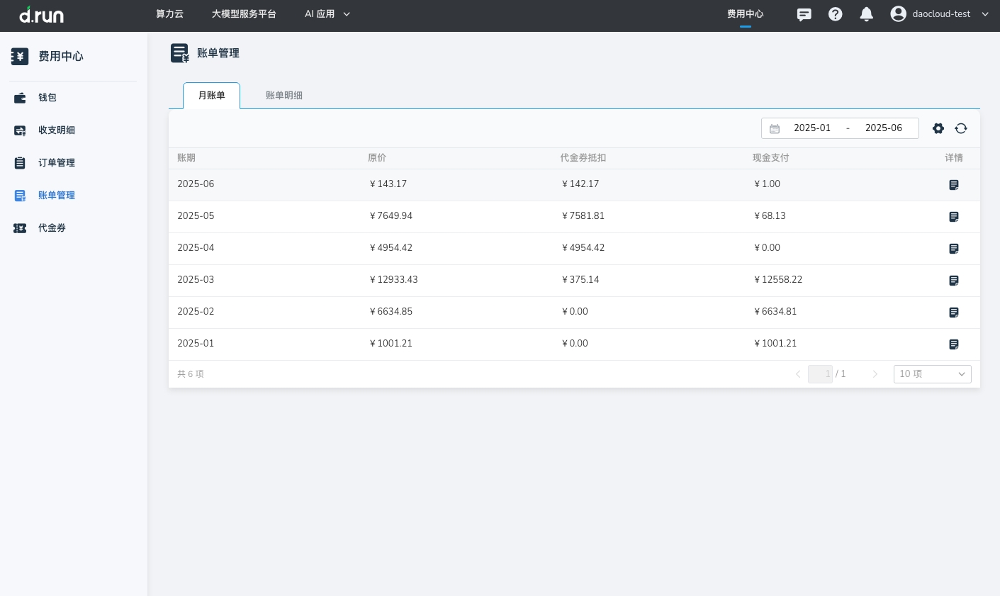
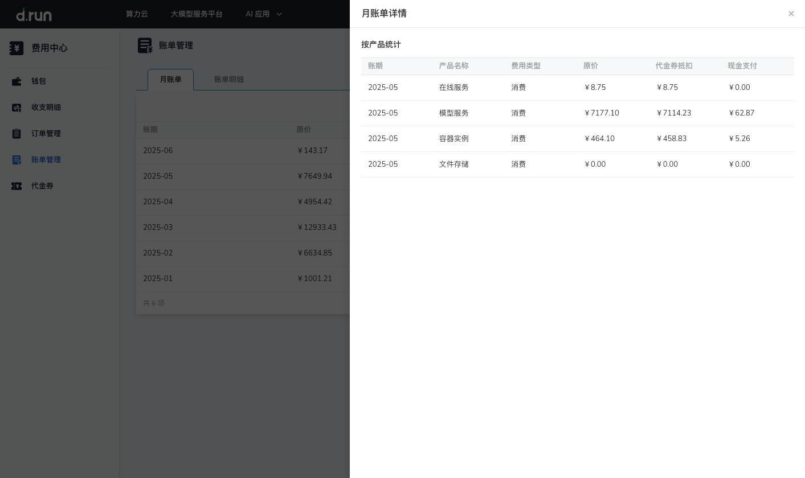

---
hide:
  - toc
---

# 账单管理

**账单管理** 为用户提供多维度的费用统计与明细查询，帮助企业全面掌握消费情况，优化财务管理。
目前支持：

- **账单明细** 记录用户每笔购买的详细消费信息，涵盖各项资源的具体使用量和对应费用，  
  不同于关注[账户钱包](./index.md)余额变化的[收支明细](./transactions.md)。
- **月账单** 按月汇总统计用户的整体消费情况，详细展示每个月的总支出及各类产品的消费明细，  
  帮助用户快速了解费用变化趋势，便于进行预算规划与费用分析。

## 操作步骤

- 进入 **月账单** 页面，可查看当前用户在平台内的月度消费汇总。

    

    点击操作列的图标，可查看各产品的月度消费情况。

    

- 进入 **账单管理** 页面，可查看当前平台内的 **账单明细**

    - 点击搜索框后选择过滤条件，支持通过“账单号”、“订单号”、“资源 ID”、“产品名称”、“计费方式”进行搜索或过滤。
    - 点击时间选择器可查询具体时间范围内的明细账单。

    

    | 显示字段 | 说明 |
    | --- | --- |
    | 账单号 | 唯一标识每条账单记录的编号 |
    | 账单周期 | 表示记录本次账单结算的时间范围 |
    | 账期 | 表示账单所属的月份范围 |
    | 产品名称 | 账单涉及的产品名称 |
    | 资源名称/ID | 消费关联的具体资源的名称或唯一标识符 |
    | 计费方式 | 资源的计费模式，如包年包月或按量付费 |
    | 用量 | 资源的实际使用量，按资源使用的单位显示，如小时、GB 等 |
    | 订单号 | 与该账单相关联的订单编号，便于追溯具体消费来源 |
    | 原价 | 资源的未扣除折扣或优惠前的费用 |
    | 现金金额 | 户实际支付的现金部分费用，扣除优惠后应付的金额 |

## 更多信息

- 了解[计费规则](./pricing-rules.md)
- 了解[退费说明](./refunds.md)
