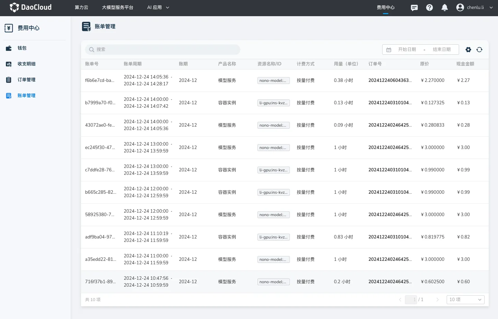

---
hide:
  - toc
---

# 账单管理

**明细账单** 中详细记录用户购买产品的消费情况账单，包含每项资源的使用量以及具体费用。

## 操作步骤

进入 **账单管理** 页面，可查看当前平台内的 **账单明细**

- 点击搜索框后选择过滤条件，支持通过“账单号”、“订单号”、“资源 ID”、“产品名称”、“计费方式”进行搜索或过滤。
- 点击时间选择器可查询具体时间范围内的明细账单。

{width=900px}

## 账单列表的字段说明

| 显示字段 | 说明 |
| --- | --- |
| 账单号 | 唯一标识每条账单记录的编号 |
| 账单周期 | 表示记录本次账单结算的时间范围 |
| 账期 | 表示账单所属的月份范围 |
| 产品名称 | 账单涉及的产品名称 |
| 资源名称/ID | 消费关联的具体资源的名称或唯一标识符 |
| 计费方式 | 资源的计费模式，如包年包月或按量付费 |
| 用量 | 资源的实际使用量，按资源使用的单位显示，如小时、GB 等 |
| 订单号 | 与该账单相关联的订单编号，便于追溯具体消费来源 |
| 原价 | 资源的未扣除折扣或优惠前的费用 |
| 现金金额 | 户实际支付的现金部分费用，扣除优惠后应付的金额 |
