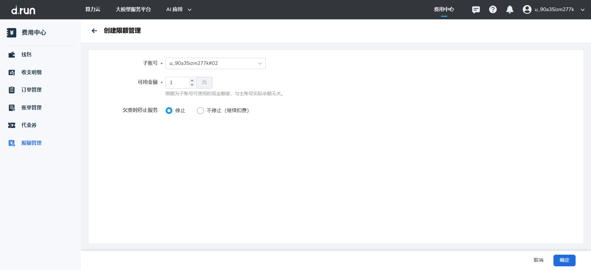
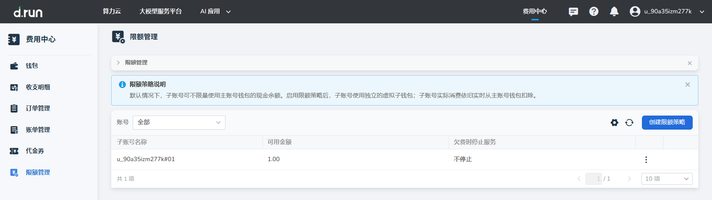

# 限额管理

**限额管理** 为主账号提供对子账号资金使用的精细化控制功能。通过设置虚拟钱包限额，主账号可以有效隔离不同子账号的预算，防止单一子账号过度消耗主账号的整体余额。

默认情况下，子账号共享主账号的真实余额。一旦开启限额管理，子账号将仅能查看并使用为其分配的 **虚拟钱包余额**。当虚拟余额达到预设阈值时，系统将触发相应的服务保护机制。

## 操作步骤

1. 在 **限额管理** 列表中，可以查看所有已设置限额策略的子账号及其运行状态。
* **查询**：点击账号搜索框，在下拉列表中选择或搜索特定子账号进行快速定位。
* **列表明细**：表格直观展示了子账号名称、可用金额以及欠费保护状态。


{width=900px}
!!! note
```
 当子账号的虚拟钱包扣费由正转负时，系统将立即发送欠费通知短信至该子账号绑定的手机号，请及时关注余额变动。

```


2. **创建限额策略**：点击页面右侧的 **创建限额策略** 按钮。
* 选择目标子账号。
* 设定 **可用金额**（即触发服务停止的余额阈值，可设置为非零值）。
* 配置 **是否在欠费时停止服务**：开启后，若余额低于限额，该子账号下的运行资源将被强制停止。
   

3. **管理现有策略**：点击列表每一行最右侧的 **更多（...）** 图标，可以对已有的限额配置进行以下操作：
* 修改 **可用金额**。
* 调整 **是否在欠费时停止服务** 的开关状态。
* **删除**：删除后，该子账号将恢复为共享主账号真实余额的状态。
  


---

### 字段说明

| **字段** | **说明** |
| --- | --- |
| 子账号名称 | 设置了限额策略的子账号用户名。 |
| 可用金额 | 允许子账号消耗的余额阈值。当虚拟余额触及此值时，视为欠费。 |
| 欠费时停止服务 | 状态开关。开启后，子账号欠费将导致其相关资源自动停机。 |


