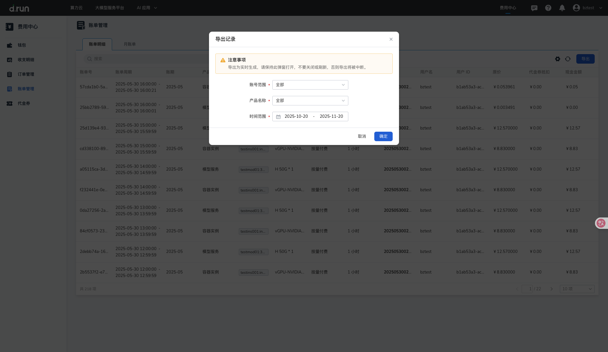

---
hide:
  - toc
---

# 账单明细

**账单管理** 为用户提供多维度的费用统计与明细查询，帮助企业全面掌握消费情况。账单管理为用户提供多维度的账单统计与明细查询，优化财务管理。其中，账单明细支持用户查看平台内所有资源的逐笔计费记录，提供账单号、产品名称、计费方式、订单号、原价等信息。用户可通过账号范围、表格部分字段、时间范围来进行精确查询，并支持按条件导出账单明细，便于财务对账与成本管理。

## 字段说明

进入 **账单管理** 页面，点击 **账单明细** ，可查看当前平台内的账单列表。

    | 显示字段 | 说明 |
    | --- | --- |
    | 账单号 | 唯一标识每条账单记录的编号 |
    | 账单周期 | 表示记录本次账单结算的时间范围 |
    | 账期 | 表示账单所属的月份范围 |
    | 产品名称 | 账单涉及的产品名称 |
    | 资源名称/ID | 消费关联的具体资源的名称或唯一标识符 |
    | 计费项 | 表示本次计费对应的资源规格或使用项 ｜ 
    | 计费方式 | 资源的计费模式，如包年包月或按量付费 |
    | 用量（单位） | 资源的实际使用量，按资源使用的单位显示，如小时、GB 等 |
    | 订单号 | 与该账单相关联的订单编号，便于追溯具体消费来源 |
    | 用户名 / 用户 ID | 触发本次资源消费的用户信息 ｜
    | 原价 | 资源的未扣除折扣或优惠前的费用 |
    | 代金券抵扣 | 该笔账单中由代金券抵扣的金额 ｜
    | 现金金额 | 户实际支付的现金部分费用，扣除优惠后应付的金额 |

## 多条件筛选

### 按账号范围筛选

账单明细支持按账号查看不同来源的账单数据。点击 **账号** 下拉选择框，可选择任一选项：

    * 全部
    * 主账号
    * 子账号A
    * 子账号B

### 按字段筛选

账单支持按多种字段搜索，包括：

    * 账单号
    * 订单号
    * 资源 ID
    * 产品名称
    * 计费方式

### 按时间范围筛选

点击时间选择器，可查询指定时间范围内的账单记录。

## 导出功能

点击 **导出** 按钮，可导出账号范围、产品名称、时间范围筛选条件下的账单明细数据，用于对账或财务归档。

    

## 更多信息

* 了解[计费规则](./pricing-rules.md)
* 了解[退费说明](./refunds.md)
