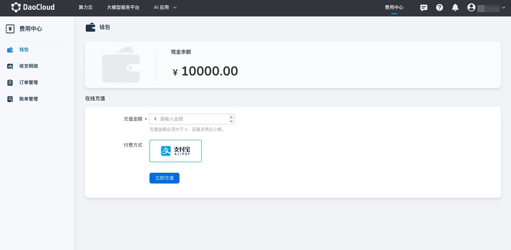

---
hide:
  - toc
---

# 钱包

钱包是用户在 d.run 平台的资金账户，用户可进行充值、查看现金余额、查看代金券等操作。钱包的余额可直接用于购买平台服务，同时，用户可在[收支明细](./transactions.md)中按需查看充值与支付记录，实现清晰、可追溯的资金使用。

## 充值方式

当前充值方式支持 **线上充值** 与 **线下汇款** 。

!!! note

    1. 充值的金额只有在消费后才可开具发票。
    2. 如需开具发票，可在官网联系售后。
    
=== "线上充值"

    !!! note
    
        为了合规性要求，线上充值前必须完成[实名认证](../manage/personal/authn.md)！
    
    1. 进入 **钱包** ，点击 **线上充值** ，输入充值金额，并选择付款方式。
    
    2. 点击 **立即充值** 按钮，跳转到第三方支付渠道完成付款。
    
        {width=900px}
    
    3. 充值完成后，在 **现金余额** 查看当前账户的总余额，并可在[收支明细](./transactions.md)中查看充值记录。

=== "线下汇款"

    !!! note
    
        转账或汇款时，请用户备注贵司名称及账号名或注册邮箱，便于我们区分汇款来源并及时登记至您的名下。
        
    1. 进入 **钱包** ，点击 **线下汇款** ，从页面获取收款账户的信息。
    
    2. 按银行流程完成线下转账，并保留银行回单。
    
    3. 完成汇款后，联系客服处理，提交核对转账所需的信息。
    
    4. 核对成功后，转账金额将增加到 **现金余额** 中，并可在[收支明细](./transactions.md)中可查看充值的记录。

[注册并体验 d.run](https://console.d.run/){ .md-button .md-button--primary }
