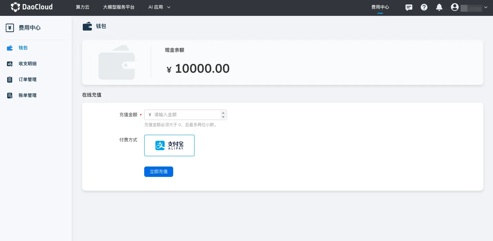
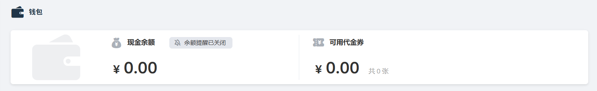
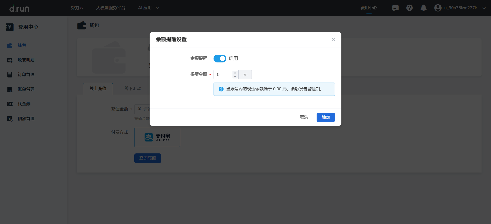

---
hide:
  - toc
---

# 钱包

钱包是用户在 d.run 平台的资金账户，用户可进行充值、查看现金余额、查看代金券等操作。钱包的余额可直接用于购买平台服务，同时，用户可在[收支明细](./transactions.md)中按需查看充值与支付记录，实现清晰、可追溯的资金使用。

## 充值方式

当前充值方式支持 **线上充值** 与 **线下汇款** 。

!!! note

    1. 充值的金额只有在消费后才可开具发票。
    2. 如需开具发票，可在官网联系售后。
    
=== "线上充值"

    !!! note
    
        为了合规性要求，线上充值前必须完成[实名认证](../manage/personal/authn.md)！
    
    1. 进入 **钱包** ，点击 **线上充值** ，输入充值金额，并选择付款方式。
    
    2. 点击 **立即充值** 按钮，跳转到第三方支付渠道完成付款。
    
        {width=900px}
    
    3. 充值完成后，在 **现金余额** 查看当前账户的总余额，并可在[收支明细](./transactions.md)中查看充值记录。

=== "线下汇款"

    !!! note 
    
        转账或汇款时，请务必备注 **贵司名称** 及 **账号名/注册邮箱**，以便我们快速核对并手动入账。
        
    1. 进入 **钱包** ，点击 **线下汇款** ，获取官方收款账户信息。
    
    2. 按银行流程完成线下转账，并保留银行回单。
    
    3. **入账方式（二选一）：**
        * **人工核销：** 联系客服人员，提交银行回单及账号信息，由后台人员手动完成余额发放。
        * **API 自助入账：** 具备开发能力的用户，可参考“API 自助入账”页签，调用接口提交入账申请。
    
    4. 核对/调用成功后，转账金额将增加到 **现金余额** 中。

=== "API 自助入账 (开发者)"
    
    1. 获取认证 Token：使用具有 `费用中心-对公转账-创建` 权限的账号登录平台，从浏览器控制台获取 `Authorization` Token。
    
    2. 发送入账请求：通过命令行或 API 工具执行以下请求。请务必核实参数，**一旦提交暂不支持通过 API 回退**。
    
    ```bash
    curl --location '[https://console.d.run/apis/leopard.io/v1alpha1/wallet/corporate-transfer/recharge](https://console.d.run/apis/leopard.io/v1alpha1/wallet/corporate-transfer/recharge)' \
    --header "Authorization: Bearer <您的TOKEN>" \
    --header 'Content-Type: application/json' \
    --data '{
        "user_id" : "b6e793e4-bb3f-4cd9-8d0d-4849041bccf1",
        "amount" : "5000000",
        "serial_number" : "32861934",
        "message" : "对公转账备注",
        "payment_source_info" : {
            "account_name" : "付款单位名称",
            "bank_account" : "付款银行账号",
            "bank_name" : "付款开户行"
        }
    }'
    ```
    
    参数说明：
    
    | 参数名 | 必选 | 说明 |
    | :--- | :--- | :--- |
    | `user_id` | 是 | 需充值的用户唯一标识 ID |
    | `amount` | 是 | 充值金额，**单位为分**（如：5000000 代表 50000 元） |
    | `serial_number` | 是 | 银行交易流水号（用于唯一性核销） |
    | `message` | 否 | 交易备注信息 |
    | `payment_source_info` | 是 | **汇款方对象**，包含以下字段： |
    | ∟ `account_name` | 是 | 汇款银行账户名称 |
    | ∟ `bank_account` | 是 | 汇款银行账号 |
    | ∟ `bank_name` | 是 | 汇款银行名称 |
    
    请求成功后，可在[收支明细](./transactions.md)中查看记录。


## 余额提醒

1. 点击 **现金余额** 旁的 **余额提醒已关闭**（默认为关闭状态），即可开启。
  
     {width=900px}

2. 在弹窗中启用提醒并设置阈值。当余额低于设定金额时，系统将发送短信至绑定的手机号。
  
     {width=900px}

[注册并体验 d.run](https://console.d.run/){ .md-button .md-button--primary }
