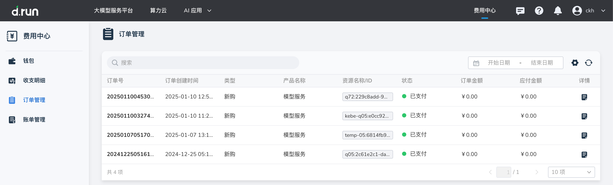
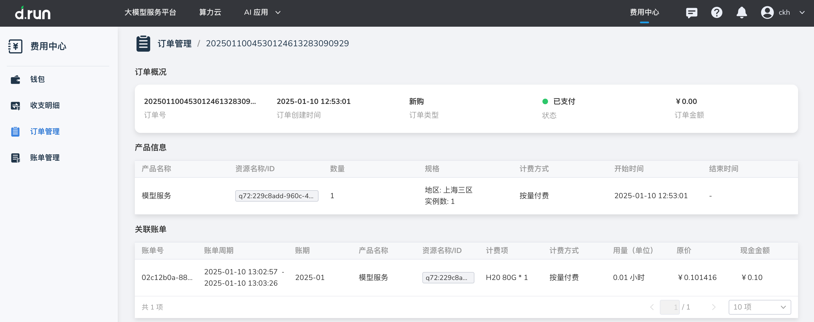

---
hide:
  - toc
---

# 订单管理

**订单管理** 为用户提供全面的订单查询与管理功能，帮助用户清晰掌握在平台购买或使用资源时的所有交易记录。  
用户可以详细查看每笔订单所涉及的产品信息、资源规格、数量及对应金额，确保交易透明、明细清晰。  
此外，订单管理还支持按时间、状态等条件筛选，方便用户快速定位和跟踪订单状态，提升管理效率。

## 操作步骤

1. 在 **订单列表** 中可以查看用户购买或操作资源时的详细记录。

    过滤：点击搜索框后选择过滤条件，支持通过“订单号”、“资源 ID”、“类型”、“产品名称”、“状态”进行搜索或过滤。

    {width=900px}

    !!! note

        按量付费的资源是根据实际使用情况实时计费的，而不是在订单生成时确定具体金额，
        故按量付费的资源产生的订单的 **订单金额** 和 **应付金额** 都为 0。

2. 点击每一行右侧的 **详情** 图标，可查看订单所购买或操作资源的详细规格信息和计费类型等信息，并可以查看该资源消费产生的[账单信息](./bills.md)。

    {width=900px}

    | **字段** | **说明** |
    | --- | --- |
    | 订单号 | 唯一标识每个订单的编号，用于查询或管理订单记录。 |
    | 订单创建时间 | 订单生成的时间点，表示购买或操作的具体时间。 |
    | 类型 | 订单的类别，如新购、续费、升级或降配等操作类型。 |
    | 产品名称 | 订单涉及的产品名称，如容器实例、模型服务等。 |
    | 资源名称/ID | 订单关联的具体资源标识，如容器实例名或资源唯一 ID。 |
    | 状态 | 订单当前的处理进度或结果状态，如已支付、已退款、已取消等。 |
    | 订单金额 | 订单的总金额，表示未扣除优惠或折扣前的费用。 |
    | 应付金额 | 用户实际需要支付的金额。 |
