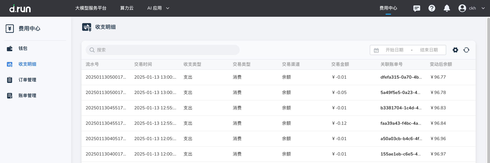

---
hide:
  - toc
---

# 收支明细

**收支明细** 详细记录钱包账户中的每笔现金流动，涵盖所有收入与支出项。  
用户可以清晰查看每笔交易的时间、类型、金额及对应的业务场景，确保账目透明、明细清晰。  
通过收支明细，企业能够精准掌握资金流向，有效辅助财务核算与资金管理，提升资金使用效率。

## 操作步骤

在收支明细页，可以查看现金余额的明细变动。

- 点击搜索框后选择过滤条件，支持通过“流水号”、“关联[账单](./bills.md)号”、“收支类型”、“交易类型”、“交易渠道”进行搜索或过滤。
- 点击时间选择器可查询具体时间范围内的明细。

{width=900px}

| **字段** | **说明** |
| --- | --- |
| 流水号 | 收支明细中单次交易的唯一编号。 |
| 交易时间 | 交易的具体时间。 |
| 收支类型 | 类型有：收入、支出。 |
| 交易类型 | 交易的类型，分为：充值、消费。 |
| 交易渠道 | 交易的渠道，分为：支付宝、余额。 |
| 关联账单号 | 本次交易所关联的账单号，若无则显示“-”。 |
| 变动后余额 | 发生本次交易后现金余额剩余的金额。 |
