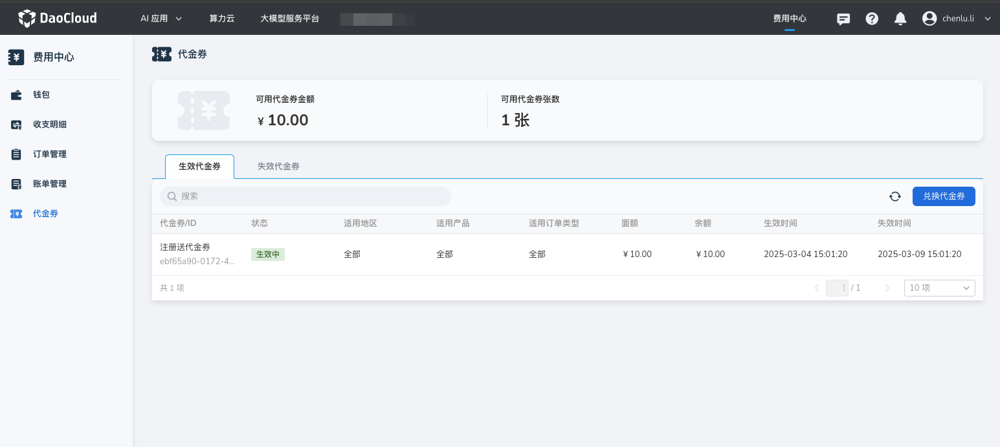
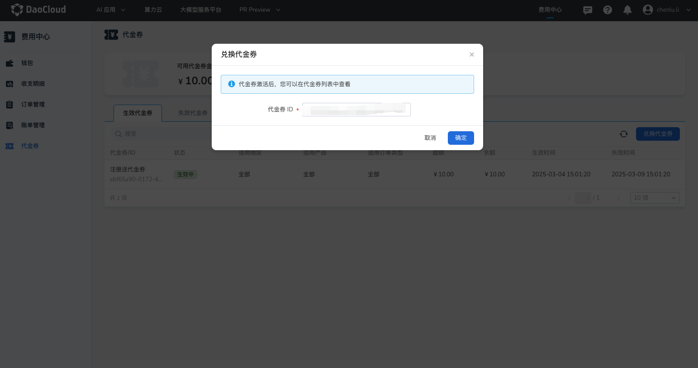

---
hide:
  - toc
---

# 代金券

**代金券** 是一种可替代现金的优惠凭证，用户可通过兑换码进行激活使用。  
在符合使用规则和条件的指定场景下，代金券能够直接抵扣相应的消费金额，帮助用户降低成本。  
d.run 平台提供便捷的代金券管理功能，支持查看有效期限、使用记录及剩余额度，提升优惠使用的透明度和便捷性。

## 操作步骤

1. 在 **代金券列表** 中可以查看当前登陆账号的所有代金券信息，包括代金券的使用限制、面额以及生效时间等信息。

    

2. 点击 **失效代金券** 可看到当前账户中已超过生效时间或已花费完成的代金券记录。

    

### 通过兑换码兑换代金券

登录账户后，在 **代金券** 页面点击 **兑换代金券** 按钮后，弹出窗口中输入兑换码并提交。系统将验证有效性，成功后自动发放至账户。

## 使用规则

1. 代金券状态分为生效中、已过期、已用完。

    - 生效中：处于代金券的有效期内，且可用余额不等于 0。
    - 已过期：超过代金券的有效期，且可用余额不等于 0。
    - 已用完：代金券在有效期内已用完。

2. 按量计费的产品确认订单后的扣款规则：先扣代金券，再扣现金。
3. 对于按用量计费的产品，符合条件的代金券会在每次出账时自动抵扣费用，直至有效期结束或余额耗尽后失效。
