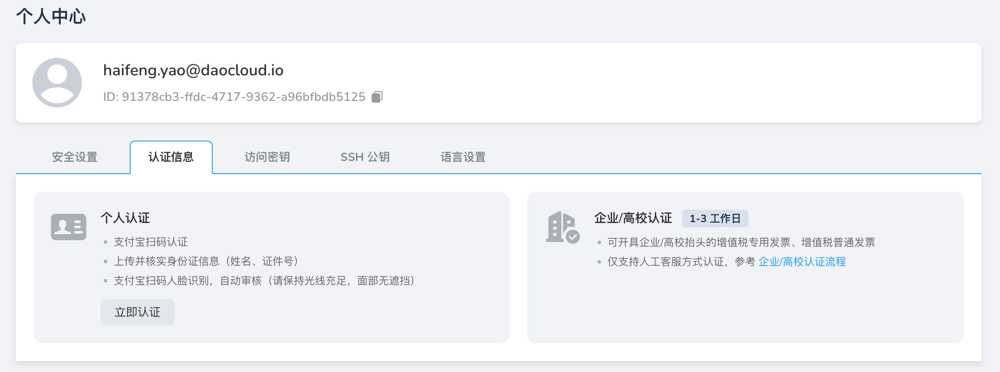

# 认证信息

为保障平台服务的合规性与安全性，用户需完成相应的实名认证流程。
d.run 支持 **个人认证** 和 **企业/高校认证** 两种方式。

## 个人认证

适用于个人用户，认证流程快捷高效，通常在几分钟内自动完成审核。

认证步骤如下：

1. **支付宝扫码认证**  
   使用支付宝扫描认证二维码，绑定实名认证信息。

2. **上传并核实身份证信息**  
   提交真实有效的身份证件，系统将自动校验姓名与证件号码的匹配性。

3. **人脸识别验证**  
   使用支付宝完成人脸识别，自动进行比对与审核。  

    > 请确保光线充足，面部无遮挡，以提升识别准确率。

完成以上步骤后，系统将自动完成认证，无需人工干预。

## 企业/高校认证

适用于具备法人资格的公司、高校及其他组织机构。

认证完成后，可享受以下专属服务：

- 支持开具企业/高校抬头的 **增值税专用发票** 或 **增值税普通发票**
- 享有专属客服与发票支持通道

认证方式：

- 当前仅支持**人工客服认证**流程  
  请根据文档指引准备材料并联系平台客服提交申请。

详细步骤请参考[企业/高校认证流程](../service/enterprise-certification.md)。
