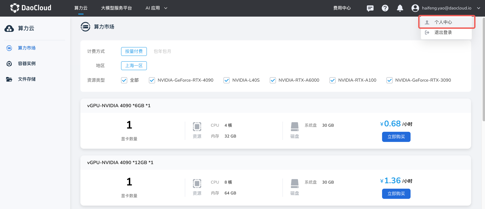
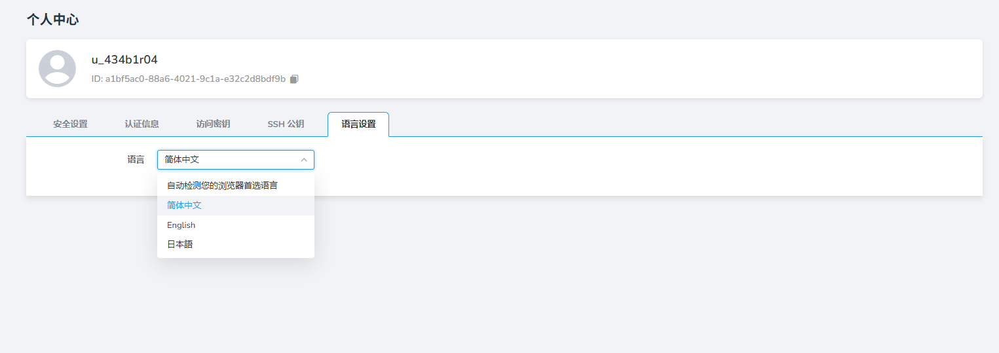

---
hide:
  - toc
---

# 语言设置

本节说明如何设置界面语言。目前支持简体中文、English 和日本語三种语言。

语言设置是平台提供多语言服务的入口，d.run 默认显示为简体中文，用户可根据需要选择其他语言或自动检测浏览器语言首选项的方式来切换语言。
每个用户的多语言服务是相互独立的，切换后不会影响其他用户。

平台提供四种语言选项：自动检测您的浏览器语言首选项、简体中文、English 和日本語。

操作步骤如下。

1. 使用您的用户名/密码登录 d.run，从右上角进入 **个人中心**

    

1. 点击 __语言设置__ 页签

    

1. 切换语言选项
