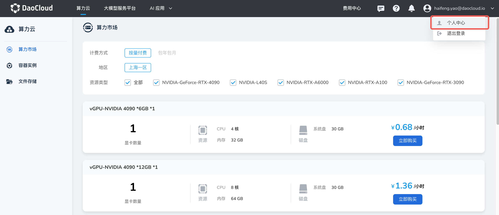
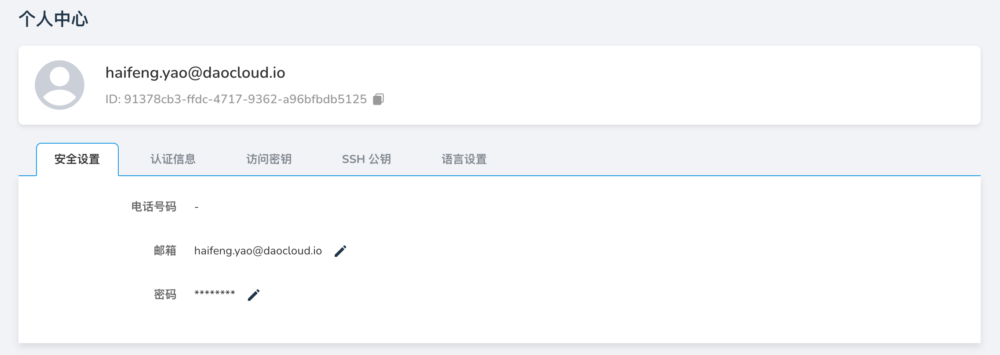

---
hide:
  - toc
---

# 安全设置

功能说明：用于填写邮箱地址和修改登录密码。

- 邮箱：当管理员配置邮箱服务器地址之后，用户能够通过登录页的忘记密码按钮，填写该处的邮箱地址以找回密码。
- 密码：用于登录平台的密码，建议定期修改密码。

具体操作步骤如下：

1. 使用您的用户名/密码登录 d.run，在右上角的下拉菜单进入 __个人中心__

    

1. 点击 __安全设置__ 页签，可以修改您的电话号码、邮箱和密码。

    

[注册并体验 d.run](https://console.d.run/){ .md-button .md-button--primary }
