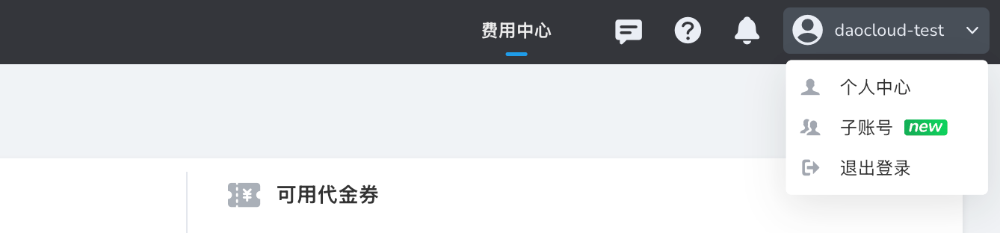
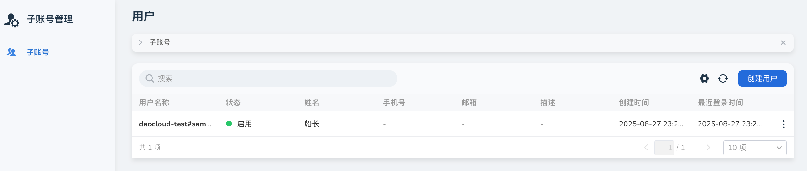

# 子账号管理

子账号管理功能允许主账号创建和管理多个子账号，实现组织内的账号分级管理和资源统一计费。

## 名词解释

- **主账号**：完成实名认证且拥有钱包与全局管理权限的账户。主账号可以创建和管理子账号，承担所有子账号的费用。
- **子账号**：由主账号创建，可独立登录、使用平台资源，计费归集到主账号。子账号之间数据完全隔离，无需单独实名认证和充值。

## 访问入口

### 前提条件

使用子账号管理功能前，主账号必须已完成实名认证。实名认证通过后才能启用子账号功能。

### 访问步骤

1. 登录到 d.run 平台
2. 点击右上角头像，在下拉菜单中找到 **子账号** 入口
3. 点击进入子账号管理界面

## 管理功能

### 账号操作

主账号可以对子账号执行以下操作：

- **创建子账号**：创建新的子账号并设置基本信息
- **禁用子账号**：临时禁用子账号的登录和资源使用权限
- **删除子账号**：永久删除子账号及其相关数据
- **资料修改**：修改子账号的基本信息和配置

### 数据隔离

- 子账号可以独立登录平台，使用各项功能和服务
- 子账号之间的数据完全隔离，互不影响
- 每个子账号拥有独立的工作空间和资源视图

### 计费管理

- 子账号无需单独充值，所有消费统一从主账号钱包扣费
- 支持按子账号维度进行费用统计和分析
- 可在账单和交易明细中查看各子账号的具体消费情况

## 命名规范

### 用户名格式

子账号用户名采用固定格式：`<主账号标识>#<子账号名>`

**示例**：`daocloud-test#samzong`

### 字符限制

- **允许字符**：小写字母（a-z）、数字（0-9）、分隔符（-）
- **长度限制**：1-49 个字符
- **开头结尾**：必须以字母或数字开头和结尾
- **禁用字符**：不允许空格、中文、特殊字符

### 重要说明

!!! warning "注意"

    用户名创建后不可变更，请谨慎命名。

## 安全设置

子账号支持完整的安全管理功能：

### 登录安全

- **密码重置**：主账号可以为子账号重置登录密码
- **登录状态管理**：可以查看和管理子账号的登录状态

### 访问控制

- **访问密钥（AK/SK）**：为子账号生成和管理 API 访问密钥
- **SSH 公钥**：配置 SSH 公钥实现免密访问服务器资源
