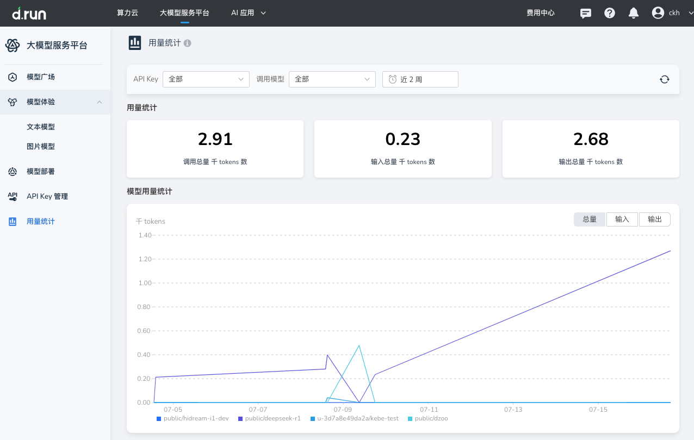

---
hide:
  - toc
---

# 用量统计

用量统计是大模型服务平台的基本功能之一，旨在帮助用户全面掌握大模型调用过程中的资源消耗情况。
该模块整合了多维度数据，如调用总量、输入输出 token 数等，支持用户进行成本分析、资源优化和业务决策。

其核心价值为：

* **成本管控**：精确统计调用量（以千 tokens 为单位），结合平台计费规则，帮助用户预估和控制成本，避免资源浪费。
* **业务分析**：通过趋势图和模型分布，深入了解不同业务场景下的调用特征，优化模型选择与业务流程。
* **资源优化**：识别高频、高消耗模型，合理配置资源，提升平台整体效率。

## 操作说明

登录大模型服务平台后，在左侧导航栏点击 **用量统计**，即可进入模块主界面，开始数据查询与分析。

### 设置筛选条件

* **API Key 筛选**：点击 “API Key” 下拉菜单，可选择某个特定 Key 或 “全部” 查看对应的用量数据。
* **模型筛选**：通过 “调用模型” 下拉菜单，选择特定模型（如 `public/deepseek-r1`）或 “全部”，聚焦目标模型的数据分析。
* **时间范围筛选**：点击时间选择框（默认“近两周”），可自定义时间段（如单日、多日），满足不同统计需求。

### 查看与解读数据

* **用量概览**：页面顶部展示三项核心指标：

    * 调用总量（千 tokens）
    * 输入总量（千 tokens）
    * 输出总量（千 tokens）
      快速掌握整体资源使用情况。

* **趋势图分析**：下方折线图展示不同模型在所选时间段内的用量走势。图例区分模型，例如 `public/deepseek-r1` 显示为紫色线。
  可切换 “总量”、“输入”、“输出” 三个维度，辅助分析调用趋势和业务波动。

### 数据刷新

点击页面右上角的刷新图标，即可获取最新用量数据，确保展示内容实时、准确。

## 应用场景示例

- 成本核算

    财务人员可在月末选择 “全部 API Key” 并设定当月时间范围，查看调用总量等数据，并结合 token 单价，计算出大模型使用成本，生成费用报表。

- 业务诊断与优化

    当某业务线响应变慢时，分析师可通过该模块筛选相关 API Key 和模型，查看用量趋势。若发现调用量激增且模型性能下降，可及时调整模型或优化调用策略。

- 运维与资源规划

    运维人员可定期（如每周）查看各模型的调用量及变化趋势，识别资源瓶颈：

- 对高频模型，提前扩容保障服务能力；
- 对低频模型，考虑缩减资源以提高整体利用率。
