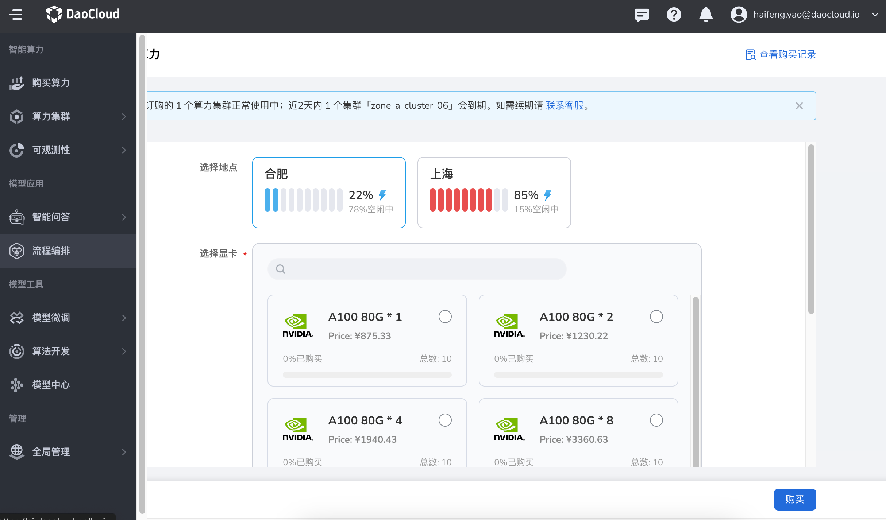
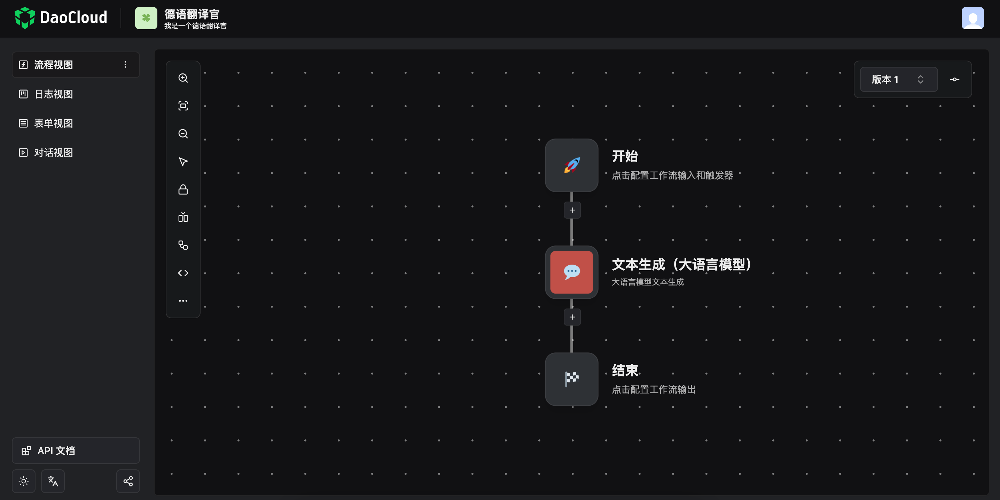
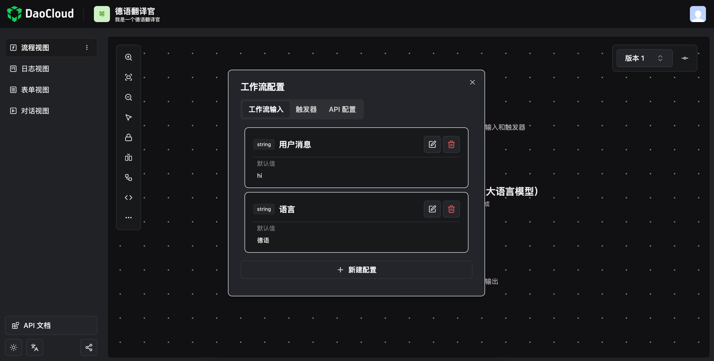
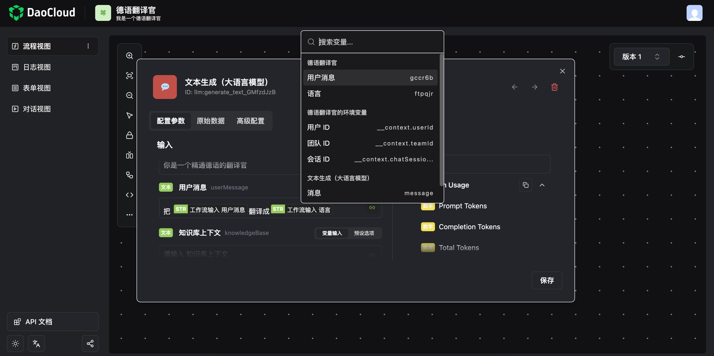
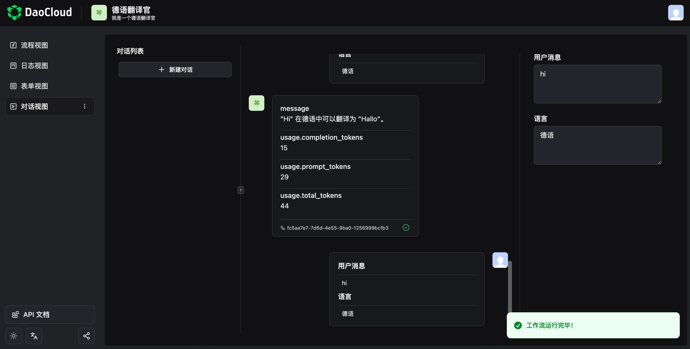
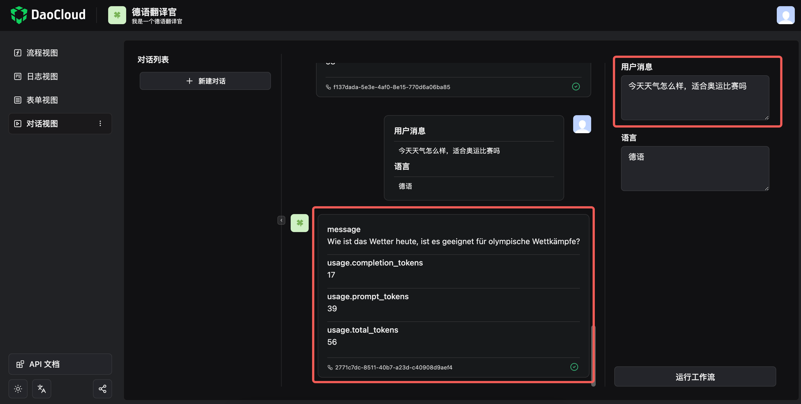
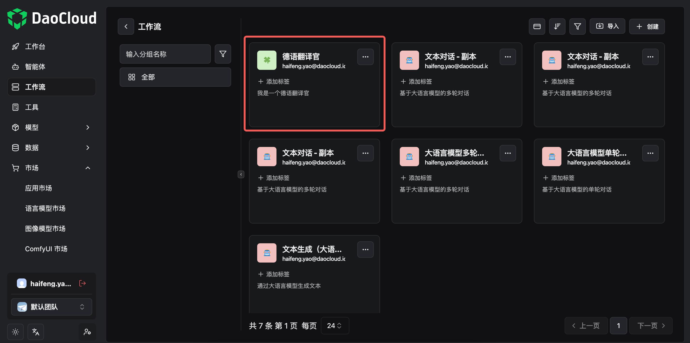

---
hide:
  - toc
---

# 通过工作流创建应用

流程编排的核心是基于应用市场、语言模型、数据通过编排工作流来批量生产面向用户的文生文、文生图等智能应用。
本文通过工作流以系统内置的 gpt-4o 模型创建一个简单的文生文对话应用「德语翻译官」为例。

## 前提条件

- 你作为一个应用开发者，[登录 d.run](https://console.d.run/) 并[购买了算力](../buy/buy.md)

## 开始创建工作流应用

1. 点击左上角 <span style="font-size: 20px;">≡</span>，在弹出的导航栏中点选 **流程编排**

    

1. 默认位于 **工作台** ，你可以点击 **+** 。

    

1. 系统显示了一些当前已创建的应用，你可以点击右上角的 **创建** 新建一个应用。

    

1. 默认是 **工作流应用** ，输入名称和描述后点击 **创建** ，进入流程编排界面。

    

!!! note

    你也可以使用 **应用市场** 的某个模板，直接进入流程编排。

## 流程编排

流程以节点的形式存在，从开始到结束的每个节点都是可以独立配置的。
你可以在其中定义参数变量，然后选择某个流行的大模型处理，从而生成面向用户的文本、图片和视频。

1. 在流程视图中，点击 **开始** 。

    

1. 在 **工作流输入** 中配置一些参数，比如下表第一列就是自定义的参数：

    | 显示名称  | 数据类型 | 默认值 |
    |-----------|----------|--------|
    | 用户消息  | 文本     | hi     |
    | 语言      | 文本     | 德语   |

    

1. 点击中间的红色节点，选择 **大语言模型** ，配置 **预制 Prompt** 和 **用户消息** 。

    | 字段 | 选项 | 示例值 |
    | --- | ---- | ----- |
    | 大语言模型  | 预设选项 | gpt-4o |
    | 预制 Prompt | 输入描述文本 | 你是一个精通德语的翻译官   |
    | <span style="background-color: lightgreen; color: white;">文本</span> 用户消息 | 配置一条由参数组成的、能让 gpt-4o 理解的指令 | 把 **<span style="background-color: lightgreen; color: white;">文本</span> 工作流输入 用户消息** 翻译成 **<span style="background-color: lightgreen; color: white;">文本</span> 工作流输入 语言** |

    其中，**<span style="background-color: lightgreen; color: white;">文本</span> 工作流输入 用户消息** 指的是点击右侧的 🔗 图标后所选择的参数。

    

    当然你也可以直接在 **原始数据** 页签中填入以下 JSON 示例代码：

    ```json
    {
      "inputParameters": {
        "__advancedConfig": {
        "timeout": 180
        },
        "frequency_penalty": 0.5,
        "model": "gpt-4o",
        "presence_penalty": 0.5,
        "response_format": "text",
        "systemPrompt": "你是一个精通德语的翻译官",
        "temperature": 0.7,
        "userMessage": "把 ${workflow.input.gccr6b}翻译成${workflow.input.ftpqjr}"
      },
      "name": "llm:generate_text",
      "taskReferenceName": "llm:generate_text_GMfzdJzB",
      "type": "SIMPLE"
    }
    ```

1. 保存后返回 **流程视图** ，切换到 **对话视图** 页签，点击 **运行工作流** 。

    

1. 可以看到刚刚配置的参数都生效了，系统提示用户消息 **Hi** 的德语是 **Hallo** 。
   而 **Hallo** 就是最终用户将看到的消息。

    

1. 你可以尝试修改 **用户消息** ，然后再点击 **运行工作流** ，可以看到给出了正确的德语，这就表明你创建的德语翻译官生效了。

    

## 工作流

你所创建的智能应用都在 **工作流** 页签，点击 **德语翻译官** 卡片，可以配置和添加更多参数，可以添加更复杂的流程。


