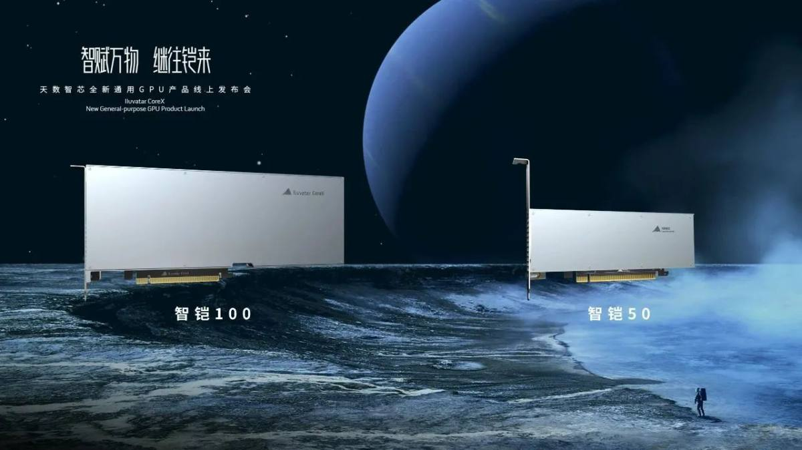

# 天数智芯

本页收集了天数智芯的部分新闻，转载自[智东西](https://zhidx.com/news/36736.html)。

## 订单接近 2 亿元

2024 年 4 月 2 日消息，[天数智芯](https://www.iluvatar.com/)宣布其去年 3 月发布的首款通用 GPU 天垓 100 芯片及天垓 100 加速卡，过去一年，天垓 100 已支撑近百个客户在 AI 领域进行超过 200 个不同种类模型训练，ResNet50、SSD、BERT 等骨干网络模型的性能接近国际市场主流产品。

此外，天垓 100 还广泛支持传统机器学习、数学运算、加解密及数字信号处理等领域，也是唯一一家已适配 x86、Arm、MIPS 等各种类型 CPU 架构的通用 GPU 产品。

天数智芯陆续与国内主要服务器厂商完成天垓 100 产品引入并进入其供应商目录，主流服务器厂商近期将会陆续发布搭载天垓 100 的服务器产品进行销售，天数智芯已与新华三集团等行业合作伙伴达成战略合作协议，开启全方位合作。目前，天垓 100 产品累计订单金额已经接近 2 亿元。

## 参与大模型训练

2023 年 6 月 10 日，在第五届智源大会 AI 系统分论坛上，上海 GPU 创企天数智芯宣布在其天垓 100 加速卡的算力集群，基于北京智源研究院 70 亿参数的 Aquila 语言基础模型，使用代码数据进行继续训练，稳定运行 19 天，模型收敛效果符合预期，证明天数智芯有支持百亿级参数大模型训练的能力。

在北京市海淀区的大力支持下，智源研究院、天数智芯与爱特云翔共同合作，联手开展基于自主通用 GPU 的大模型 CodeGen（高效编码）项目，通过中文描述来生成可用的 C、Java、Python 代码以实现高效编码。智源研究院负责算法设计、训练框架开发、大模型的训练与调优，天数智芯负责提供天垓 100 加速卡、构建算力集群及全程技术支持，爱特云翔负责提供算存网基础硬件及智能化运维服务。

在三方的共同努力下，在基于天垓 100 加速卡的算力集群上，100B Tokens 编程语料、70 亿参数量的 AquilaCode 大模型参数优化工作结果显示，1 个 Epoch 后 loss 下降到 0.8，训练速度达到 87K Tokens/s，线性加速比高达 95%以上。与国际主流的 A100 加速卡集群相比，天垓 100 加速卡集群的收敛效果、训练速度、线性加速比相当，稳定性更优。在 HumanEval 基准数据集上，以 Pass@1 作为评估指标，自主算力集群训练出来的模型测试结果达到相近参数级别大模型的 SOAT 水平，在 AI 编程能力与国际主流 GPU 产品训练结果相近。

## 智铠 100

2022 年 12 月 20 日，上海天数智芯半导体有限公司（以下简称“天数智芯”推出通用 GPU 推理产品智铠 100。智铠 100 是继天垓 100 后天数智芯正式向市场推出的第二款产品，标志着天数智芯成为拥有云边协同、训推组合的完整通用算力系统全方案提供商。

据悉，智铠 100 在今年 5 月成功点亮，拥有三大特性：

其一是计算性能高。智铠 100 芯片支持 FP32、FP16、INT8 等多精度混合计算，实现了指令集增强、算力密度提升、计算存储再平衡，支持多种视频规格解码。智铠 100 产品卡可提供最高 384TOPS@int8、96TFlops@FP16、24TFlops@FP32 的峰值算力，800GB/s 的理论峰值带宽以及 128 路并发的多种视频规格解码能力。相较于市场上现有主流产品，智铠 100 将提供 2-3 倍的实际使用性能。

其二是应用覆盖广。基于天数智芯第二代通用 GPU 架构，智铠 100 多达 800 余条通用指令集，支持国内外主流深度学习开发框架，拥有丰富编程接口拓展和高性能函数库，可灵活支持各种算法模型，便于客户自定义开发。智铠 100 广泛适用于智慧城市、智慧港口、智慧交通、智能制造、电力、智能语音、医疗、教育、智慧金融等众多场景。

其三是使用成本低。延续天垓 100 开发易迁移的特点，智铠 100 全面支持推理及训练一体化方案，能够在不额外增加购置成本的情况下完成增量训练工作，有效减少用户的成本支出。延续天垓 100 的生态兼容策略，智铠 100 仍提供开箱即用的产品体验，降低用户的开发成本和使用成本。

## 融资消息

2022 年 7 月 13 日消息，上海天数智芯半导体有限公司宣布完成超 10 亿元人民币的 C+轮及 C++轮融资，本轮融资将助力公司量产 AI 推理芯片智铠 100，开发第二三代 AI 训练芯片天垓 200 及 300，扩展天数智芯软件平台，加速 AI 与图形融合。

C+ 轮由金融街资本领投，C++ 轮由厚朴投资和旗下的厚安创新基金（即厚朴投资和全球知名半导体技术 IP 公司 ARM 的合资基金管理公司）领投，中关村科学城科技成长基金、上海国盛、熙诚致远、新兴资产、鼎祥资本、鼎礼资本、粤港澳产融、上海自贸区股权基金等知名企业及机构参与投资。

