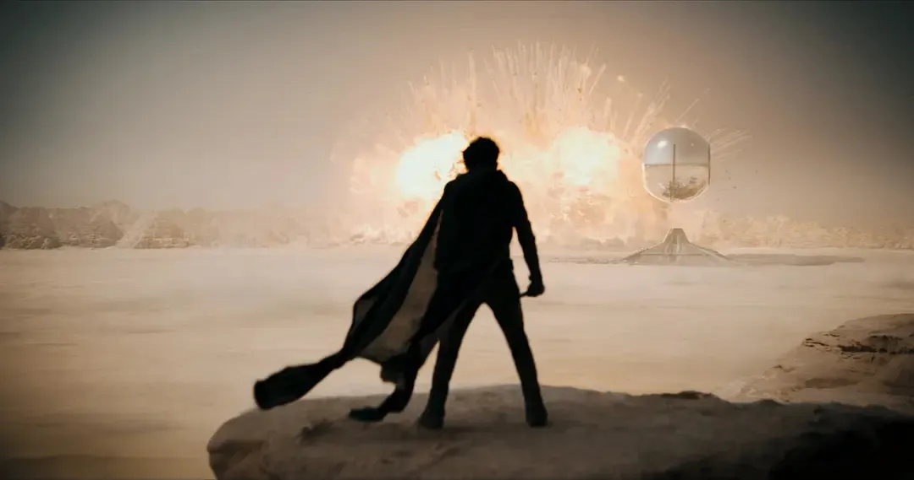

# 从 Moonshot 崛起看中国大模型

> 图 1：投资人对月之暗面的第一期许是“做出 Global AGI”，第二才是商业化。

近期，自月之暗面宣布 Kimi 可支持 200 万汉字的无损上下文输入能力后，Kimi 相关热点先后两次登上微博热搜。

第一次是“Kimi 概念股”。在 200 万汉字上下文输入能力正式官宣后，A 股市场与 Kimi 存在关联关系的多只个股，包括掌阅科技、华策影视、超讯通信 、中广天择、世纪天鸿、海天瑞声、九安医疗等等相继涨停。

第二次是关于“Kimi 获客成本”。报道称，根据 Kimi 投放广告的成本、拉新后用户问答互动产生的算力成本，以及在第三方平台的下载量估算，近一个月来 Kimi 每天的获客成本至少达到 20 万元。

这也使得月之暗面（Moonshot AI）成为自 2023 年 GPT 热潮席卷以来，第一家凭借自身产品“破圈出道”，走进大众视野，在路人面前怒刷存在感的大模型独角兽公司。甚至，由于用户激增、大流量，Kimi 服务器一度宕机。

Kimi 是真火了。

但若细看月之暗面的崛起，除去资本的轰抢与市场的高度关注，在一众中国超 20 亿美元估值的大模型公司中，月之暗面的路径实则别具一格。因为支撑月之暗面高关注度的两大要素——技术进展与商业节奏，其实在一众竞争对手中并不明显：

首先，相比其他的大模型公司，包括智谱 AI、MiniMax、深言科技、面壁智能、百川智能，甚至光年之外（后被美团收购）在内，月之暗面的成立时间要晚得多，团队磨合、技术进展也自然相对滞后。尽管杨植麟的技术实力受到广泛认可，但根据 SuperCLUE 的评测，目前 Moonshot 的综合能力仅超过 GPT-3.5，仍在追赶 GPT-4。

其次，月之暗面的大模型产品与商业化节奏并不算快。以智谱为例，智谱在去年就开始组建商业化团队，探索基座大模型的商业服务，而月之暗面主打 To C，目前推出 Kimi 智能助手，但商业色彩并不浓厚。

但月之暗面却能在短时间内获得多轮投资，后来居上，一跃跻身于中国大模型初创企业的第一梯队。有消息甚至称，月之暗面的估值已经超过智谱 AI。2023 年过去，当大多数大模型公司都在经历“商业化”的灵魂拷问、被质疑“如果再不商业化、2023 年的融资也许只能烧到 2024 年年底”时，同样聚焦基座大模型的月之暗面显得更加突出。

对于这一差异，AI 科技评论询问月之暗面的投资人后，得到截然不同的认知。其中一个最具代表性的观点是：“现在我们并不要求月之暗面追求商业化，而是希望他们首先将大模型的技术做到极致。我们希望投出的大模型不只是中国最强，而是未来 AGI 时代全球最强（之一）”。

而杨植麟与月之暗面，给了他们这份信心。

## 被看好、短期内资本大量累积

仔细算下来，如今频频活跃在热度榜首的月之暗面距离成立还不到一年。

月之暗面正式成立是在 2023 年 4 月，同年 10 月推出首款大模型产品 Kimi 智能助手，最高可支持输入 20 万汉字，是彼时全球范围内 AI 大模型产品中所能支持的最长上下文输入长度。

据悉，按照 OpenAI 的计算标准，一般情况下，1 个汉字约等于 2 个 token，那么月之暗面的 20 万汉字约为 40 万 token，而同期 Anthropic 的 Claude 大模型支持的最大长文本为 10万 token。

2024 年 2 月，Kimi 对网站、多问题搜索能力进行迭代升级，可用性表现能力持续提升。

今年 3 月 18 日，月之暗面再度刷新记录，宣布 Kimi 在大模型长上下文窗口技术上取得新突破，可支持 200 万字超长无损上下文，并于即日起开启产品内测。

> 图 2：月之暗面宣布 Kimi 可支持 200 万字超长无损上下文

虽然成立不到一年，但据 AI 科技评论获悉，到目前为止，月之暗面已经进行了四轮融资。

月之暗面的首轮融资发生在2023年4月，彼时月之暗面刚从循环智能拆分出来。

循环智能（ Recurrent AI ）是一家专注于销售科技的企服，2016 年杨植麟以联合创始人的身份参与创立，主要业务是运用 NLP、语音、多模态、大模型等 AI 技术打造“销售科技”解决方案。资料显示，循环智能曾获得红杉中国、真格基金等投资方的多轮投资。

月之暗面完成第一轮融资后，估值达到 3 亿美元，投资方包括红杉中国、真格基金、励思资本。

2023 年 6 月，月之暗面进行第二轮融资，投前估值 6 亿美元，投后估值 7.7 亿美元。这一轮的投资方包括蚂蚁、阿里、美团、FunPlus，以及部分阿里战投部的成员。据悉，这一轮，由蚂蚁、阿里、美团领投。

月之暗面的第三轮融资的投资方包括云久资本、五源资本等，本轮融资后，估值约为10亿美元。

据了解，月之暗面的第三轮融资是与第四轮融资同时期谈的，也就是前不久月之暗面获得的超10亿美元这一轮。

这一轮阿里投资了 8 亿美元（更准确的数字是 7.9 亿美元），其中有超过 40% 的金额是作为阿里与月之暗面的共管账户，用来作为月之暗面买云、用云的资金。

另外，砺思资本投资 1000 万美元，其他老股东凑了 2 亿多美元，总体算下来，该轮总金额超 10 亿美元。

也就是在这一轮投资后，月之暗面的估值达到了25亿美元。

作为一家 AI 大模型初创公司，月之暗面凭什么能够吸引这么多投资者的目光？

不少投资人向 AI 科技评论表示，Moonshot 身上具有两个特点——长文本与To C，这是月之暗面出道之初便区别于其他 AI 大模型创业公司的独特之处。

长文本（Long Context）是大语言模型（LLM）的基础能力，但是如果上下文过长，模型会过多地将注意力放在文本的开头和结尾部分，忽略中间部分的信息，从而导致模型难以找到并利用放在长文中部的相关信息。

因此，如何在做到文本足够长的同时，能够保证“没有损失”变得关键。

“Lossless long context is everything。”

杨植麟曾不止一次地公开表示过，“通往通用人工智能（AGI）的话，无损的长上下文将会是一个很关键的基础技术。历史上所有的模型架构演进，本质上都是在提升有效的、无损的上下文长度。上下文长度可能存在摩尔定律，但需要同时优化长度和无损压缩水平两个指标，才是有意义的规模化 。”

而这也是月之暗面从成立就聚焦在长文本上的初心所在。

至于 ToC 的路线，这是 AI 大模型落地过程中，最有可能跑出来超级应用的方向，也是杨植麟从一开始就坚定想要做的事情。

当然，除了技术和路线，更重要的还有杨植麟的个人能力。

一位参与月之暗面投资的投资者告诉 AI 科技评论，其实在早期，他观望过智谱AI、百川智能、MiniMax、零一万物等一众 AI 大模型创业公司，最终选择了月之暗面。

“这一波 AI 是技术驱动的，（如果投资）首要考虑的就是去找技术上最强、最相关的那个人。”而当前 AI 大模型的主流架构 Transformer 曾是杨植麟之前的研究领域。杨植麟曾以第一作者发表了 Transformer-XL 和 XLNet 两篇重要论文，且学术引用量自 2019 年起已超 2 万余次，在技术上的实力自然毋庸置疑。

而且，作为创业者，杨植麟的人才号召力也很强，能够吸引到许多年轻、优秀的工业界人才，比如月之暗面的联合创始人、在各大 AI 公司浸染历练后选择加入月之暗面的员工等。

另外，杨植麟做的事情很纯粹，就是要做中国的 AGI。一位投资者表示，他聊过很多年轻的、资深的AI创业者，而杨植麟是自己见过技术上讲得最清楚、最有愿景的人。

“我们聊过好几次，现在每次聊几句话就说清楚了，他就是要做中国的 AGI。”

投资者认为，这一轮 AI 创业潮中，那些曾经在互联网时代乘风破浪的大佬的经验，有时候未必是加分项，甚至可能是包袱。因为在新的 AI 时代，所有的东西都是新的，而新的组织、新的人来做这件事，更有机会带来新的想象力。

而以上这些，都是月之暗面虽不具备先发优势，却能后来居上的原因所在，是偶然中的必然。

## 抢滩全球 AGI 的野心

“事实上，资本并没有大家想象地那么急迫。”一位投资人告诉 AI 科技评论。

近日，一微软工程师曝出为 GPT-6 搭建 10 万个 H100 训练集群，却导致整个电网崩溃的消息，再度重申了通往 AGI 之路仍需破解电力难题的困惑，却也释放出一个信号：虽然 GPT-4.5 泄露事件纷纷扬扬、GPT-5 还未发布，但 GPT-6 已经在路上。

深度学习的发展已经过去十年，较之上一波AI浪潮，这一波大模型的投资者更懂技术。他们无比清晰地认识到大模型是一门流动的、仍在继续成长的技术，GPT-4 不是终点。而“即使是 OpenAI 的路线，也并不一定是 AGI 的最终路线”。

尤其对知名投资机构来说，他们想要投出的，并不只是中国范围内的“最强大模型”，而是有资格、有潜力参与竞争“全球范围内最强 AGI”的大模型团队。在一次访谈中，杨植麟也曾公开表示，“AI 不是我在接下来一两年找到什么PMF，而是接下来十到二十年如何改变世界。”

如果跳出国内大模型鏖战的视角，站在全球视野来看， 作为典型的技术信仰派的代表，月之暗面抢滩全球 AGI 的优势或许是以下几点：

首先， 月之暗面是全球化教育下的产物，视野更广阔。创始人杨植麟毕业于清华大学计算机科学与技术系，后赴卡内基梅隆大学语言技术研究所（LTI）攻读博士，师从苹果AI研究负责人Ruslan Salakhutdinov、谷歌首席科学家 William Cohen，对国外技术的发展有着敏锐的意识与极高的关注。

实战经验方面，杨植麟曾就职于 Google Brain 和 FAIR，参与过 Google Gemini、Google Bard、“盘古”“悟道”等多个大模型的研发，更加了解国内外大模型发展的技术差距与步伐节奏，更清楚该如何在国内发展一家具有国际视野的 AI 大模型公司。

不仅是杨植麟，另外两位联合创始人周昕宇和吴育昕，也都毕业于清华大学，具备 Meta、旷视科技等知名AI公司的就职经历。

此外，据一位月之暗面的员工描述，杨植麟对具有“硅谷范”的公司十分向往，月之暗面也想往这样的风格发展。

其次，月之暗面坚定以 ToC 路线入局。一方面，AI 大模型的落地应用过程中，相较于 ToB，似乎 ToC 更有可能“跑”出来超级应用。其实还有更深层次的考量，即在迈向 AGI 的过程中，数据飞轮至关重要，基于此，ToC 路线就是必然选择。

杨植麟曾提到，对于月之暗面来说，AGI 和产品都是追求的目的，而历史上几乎所有互联网产品要“跑”出来，最终都要靠用户数据的 Scale。

也许由于发展阶段的关系，早期会依靠基础模型的 Scaling law，但拉长时间线，未来最终还是要转向用户的 Scaling law。

综合各种维度来看，ToC 路径是目前公认最适合的路径，天花板也更高。

另外，即便现在 GPT-4 的性能表现已经让人类惊呼，但大模型的想象空间仍旧很大。

而基于这种共识，能否坚定自己对 AGI 的独特理解，拥有长远的方向规划和清晰的逻辑就显得尤为关键。

对于这一点，杨植麟有自己的节奏。

一位投资人告诉 AI 科技评论，杨植麟并不在乎 GPT-5 和 GPT-6什么时候推出，但对于什么时候是 GPT-5，什么时候是 GPT-6 的时刻有自己的定义，如何做到，过程中要解决哪些问题，如何解决，以及最终模型的方向，等等。

基于此，将视野跳出国内，放眼全球来看，月之暗面角逐全球 AGI 的可能性又多了几分，而红杉中国等全球知名的资本选中月之暗面，或许也有这样的考量——留给月之暗面的时间还有很多。

而将目光聚焦在国内来看，在目前的几家 AI 大模型初创公司中，月之暗面的优势也很明显。

技术方面，月之暗面的技术团队曾参与国内外等多个大模型的研发工作，较之 MiniMax、百川智能等估值相当的公司，经验更丰富。

而技术上能与月之暗面媲美的另一家估值相当的大模型公司智谱 AI，其先发优势与成熟度或许是成立还不足一年的月之暗面所不具备的，但两者路线的不同，也决定了双方大概率不会在同一条赛道“狭路相逢”。在投资者看来，智谱 AI 的定位是“复刻 OpenAI”、坚定 To B 与 To G 路线，走信创道路。

资本方面，最早与杨植麟同时期入局大模型的智源团队中，如清华 THUNLP 走出的两家公司——深言科技与面壁智能，虽然也具备技术实力，但融资节奏远远不如月之暗面。目前深言科技的融资进行到 A+ 轮、面壁智能则进行到 Pre A。

人才储备方面，月之暗面的人才密度高，杨植麟个人的技术号召力强，公司仍处于快速发展、扩张的过程中，虽然总人数仍不过百，但人才密度在大模型初创企业中或许仅次于智谱 AI。

综合来看，月之暗面的重心在技术而非商业化，所以不管是月之暗面花重金招聘人才、每日接近砸 20 万元的成本获客、坚定 To C 与长文本路线、做超强基座大模型……都在情理之中，因为投资方“没有那么着急”，不要求月之暗面此时此刻就开始思考商业化。

也许，2024 年商业化是国内大多数 AI 大模型公司的主旋律、主线任务，但不是月之暗面的。

## 写在最后

诚然，在理念、技术、人才、资本的累积上，月之暗面身上的优势明显，长板很长，但也有一些短板上的隐忧。

有投资人告诉 AI 科技评论，目前月之暗面身上的旷视基因较重，团队中来自旷视的成员较多；另一方面经过最新一轮的融资后，阿里系重仓加持，持股比例过高。

关于第一点，凭借杨植麟的个人能力与号召力或许能扭转局势，但未来仍不确定；关于第二点，目前月之暗面仍在不断开放融资，希望可以降低阿里系在内部的话语权，而这对于其他资本力量来说也是利好。

一位接触过月之暗面，但最终没有投的投资人告诉 AI 科技评论，当初红杉投完之后也想邀他再投一轮，但他思考再三，认为杨植麟在技术能力上确实强，但他的投资观是考量综合能力，技术是要强，但也考虑基础架构、算力、数据等方面，而在这些方面，杨植麟的号召人还所有欠缺。

“他能号召顶级聪明的年轻人，但能否吸引到更高级别的人才，还不确定，毕竟他年轻，而那些（AI Infra 领域的）都是江湖上的前辈，大家是否愿意跟着他干？”

但可以确定的是，目前月之暗面的长板足够长，长到可以遮盖短期的不足，让投资方愿意买单，等待月之暗面带来不一样的 AGI 叙事方式。

## 参考

- [Kimi 网页版，注册后可用](https://kimi.moonshot.cn/)
- Kimi 智能助手，无需翻墙，目前中国本土排名第一的智能 App，月活超 800 万

> 本文转载自 [AI 科技评论](https://mp.weixin.qq.com/s/JHBPMHxYj3LvcAtL-I2nrw)
