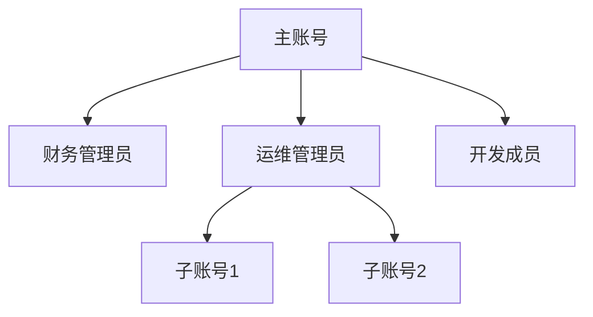

---
hide:
  - navigation
---

# 企业/高校认证服务说明（试运行）

> 更新日期：2025 年 4 月 30 日  
> 生效日期：2025 年 5 月 1 日

根据《中华人民共和国网络安全法》《企业信息公示暂行条例》等相关法律法规，上海道客网络科技有限公司（以下简称"我们"）对企业/高校用户的实名认证服务说明如下。本说明是[《实名认证服务说明》](./name.md)的补充条款，未尽事宜以《实名认证服务说明》为准。

[点击下载企业认证服务说明 PDF](./attach/enterprise-certification.pdf){ .md-button }

## 1. 服务范围

### 1.1 适用对象

- **企业用户** ：在中国大陆地区合法注册的企事业单位，包括有限责任公司、股份有限公司、个体工商户等
- **高校用户** ：经教育主管部门批准设立的高等院校、科研院所等教育机构
- **政府机构** ：各级党政机关及事业单位

### 1.2 认证等级

- **基础认证** ：验证组织机构基本信息（名称、统一社会信用代码等）
- **高级认证** ：增加法人身份验证、对公账户验证等金融级认证
- **特权认证** ：适用于需 API 接入或批量管理的企业用户（需签订补充协议）

## 2. 认证材料要求

### 2.1 必备材料

```markdown
- [ ] 营业执照/事业单位法人证书扫描件（加盖公章）
- [ ] 法定代表人身份证正反面扫描件
- [ ] 《企业实名认证授权书》[下载模板](./attach/enterprise-auth-template.docx)
```

### 2.2 特殊情形

- **分支机构认证** ：需额外提供总公司授权文件
- **外资企业** ：提供商务部门备案证明扫描件
- **高校用户** ：提供教育机构资质证明及经办人工作证

## 3. 认证流程

### 3.1 线上提交

1. 登录 d.run 控制台进入【企业认证】模块
2. 上传扫描件（PDF/JPG 格式，单个文件 ≤5MB）
3. 填写组织机构信息：

    ```yaml
    单位名称：与营业执照完全一致
    统一社会信用代码：18位字符
    认证类型：企业/高校/政府机构
    ```

### 3.2 人工审核

- 工作时间（周一至周五 9:00-18:00）提交的申请，将在 2 个工作日内完成审核
- 需补充材料时将通过站内信和邮件通知

### 3.3 认证标识

- 通过认证的企业账号将显示 <span style="color:blue;">✓ 已认证企业</span> 标识
- 高校用户显示 <span style="color:green;">🏫 教育机构认证</span> 专属标识

## 4. 信息变更管理

### 4.1 变更情形

- **重大事项变更** ：
  
    - 法人代表变更
    - 企业名称变更
    - 统一社会信用代码变更

- **一般事项变更** ：
  
    - 注册地址变更
    - 注册资本变更
    - 联系人信息变更

### 4.2 变更流程

1. 下载并填写《企业认证信息变更申请表》[下载模板](./attach/enterprise-change-form.docx)
2. 准备证明材料：

    ```markdown
    - [ ] 变更后的营业执照扫描件
    - [ ] 工商变更核准通知书（重大变更需提供）
    - [ ] 新法人身份证扫描件（法人变更时需提供）
    ```

3. 提交方式（二选一）
   
    - **线上提交** ：登录控制台进入【企业认证-信息变更】模块上传
    - **人工服务** ：发送邮件至 enterprise-support@d.run 并抄送 service@daocloud.io

### 4.3 审核时效

- 材料齐全情况下，3 个工作日内完成审核
- 审核结果将通过短信和站内信通知

## 5. 账号管理体系

### 5.1 权限架构



### 5.2 权限控制

- **角色划分** ：支持自定义角色并分配细粒度权限（详见[权限管理指南](../security.md#_4)）
- **操作审计** ：所有企业账号操作将记录至[审计日志](../security.md#_7)

## 6. 数据安全管理

### 6.1 信息存储

- 营业执照等敏感文件采用 AES-256 加密存储
- 法人身份证信息留存时间不超过认证通过后 30 天

### 6.2 信息使用

- 仅用于验证组织真实性及防止欺诈行为
- 不会向第三方披露企业证照信息（法律法规另有规定除外）

## 7. 违规处理

### 7.1 虚假材料

- 立即终止所有服务
- 冻结账户资金不少于 180 天
- 保留追究法律责任的权利

### 7.2 账号出借

- 首次发现：暂停服务并强制修改密码
- 再次违规：永久注销企业账号

## 8. 附则

### 8.1 联系我们

如遇认证相关问题，可通过以下方式联系人工客服：

- **服务热线** ：400-002-6898（工作日 9:00-18:00）
- **在线客服** ：登录控制台点击右下角 **在线咨询**
- **紧急联络** ：security@daocloud.io（7×24 小时安全事件响应）

### 8.2 文档更新

我们保留根据法律法规变化及服务升级调整本说明的权利，更新后的条款将通过以下方式公示：

- 控制台公告栏
- 注册邮箱通知
- 官网服务协议页面

- 本说明未尽事宜，参照[《实名认证服务说明》](./name.md)执行
- 认证过程中产生的人脸信息处理，遵循[《人脸信息处理规则》](./face-id.md)
- 技术实现细节详见[《平台安全白皮书》](../security.md)

[注册并体验企业认证服务](https://console.d.run/enterprise-auth){ .md-button .md-button--primary }
