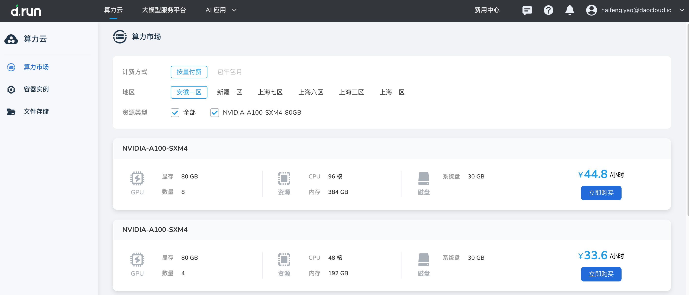
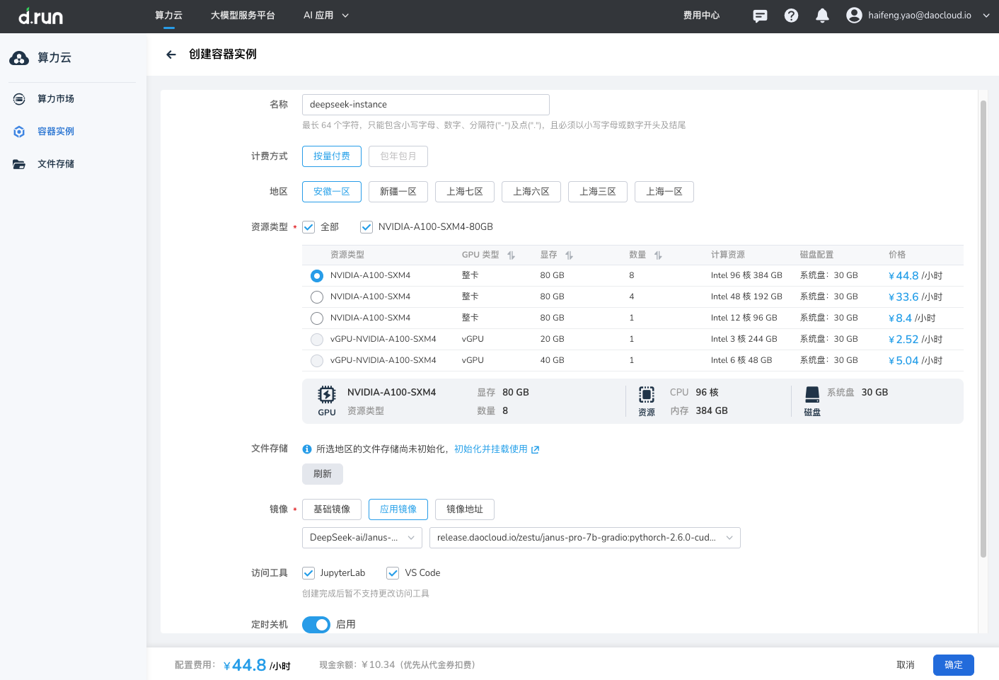
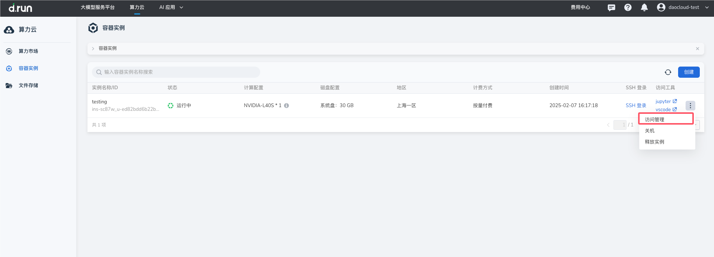
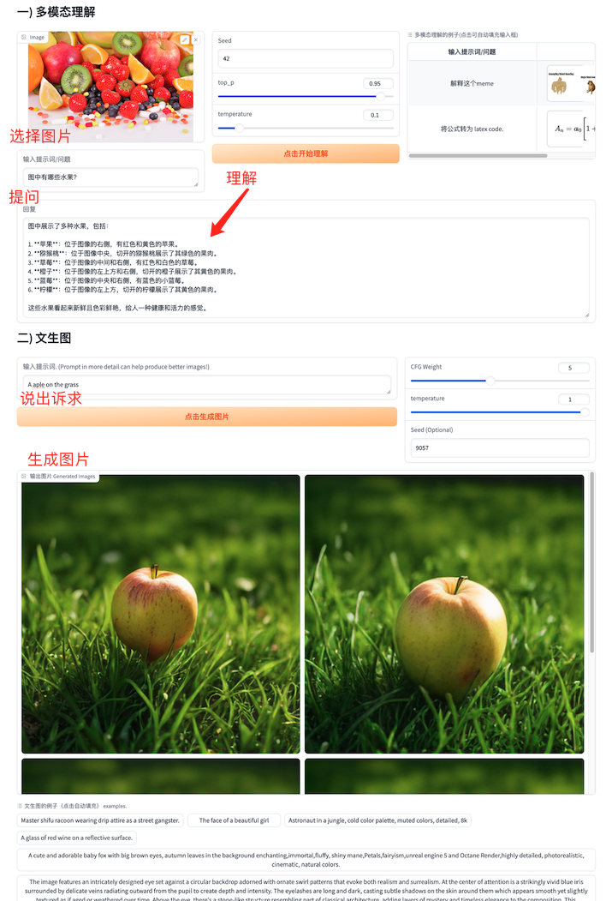
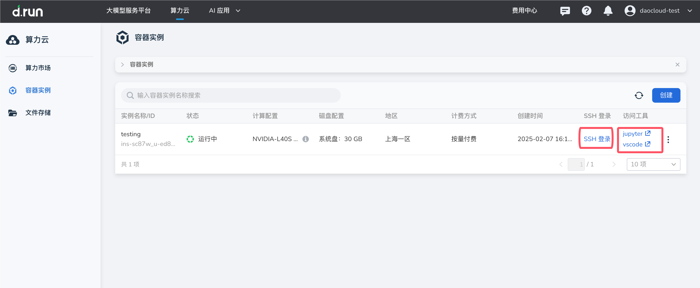

# 五步部署 DeepSeek 多模态模型

本文介绍如何在算力云模块通过容器实例直接使用 DeepSeek，以及通过 jupyter、vscode、SSH 进行算法二次开发使用。

> 算力云上线的 DeepSeek-ai/Janus-Pro-7B-ComfyUI WebUI 版文生图模型，
> 支持 Multimodal Understanding 和 Text-to-Image Generation 两种服务，部署后可通过 **10002 端口** 直接访问并使用。

## 前提条件

- 注册并登录 d.run
- 账户余额大于等于所选资源类型的单价

## 创建 DeepSeek 实例

1. 登录 d.run 平台，选择 **算力云** 进入 **算力市场** 。在算力市场页面中选择算力规格，例如 A6000, 点击“立即购买”，进入创建容器实例页面。

    !!! tip

        运行 Janus-Pro-7B 模型需约 20GB 显存，请确保所选算力规格满足此要求。

    

1. 填写实例名称，选择 DeepSeek 的镜像为 DeepSeek-ai/Janus-Pro-7B-ComfyUI。（初次使用建议初始化文件存储并挂载），点击 **确定** 后完成部署。

    

1. 刷新页面当容器实例状态为运行中时，点击 **访问管理** ，打开 **10002 端口** 即可访问 Janus-Pro-7B 的 UI 界面。

    

4. 使用 Deepseek Janus-Pro 提供的多模态理解和文生图服务。

    

## 通过 Jupyter、VSCode 进行算法二次开发

另外，通过此方法部署的 Deepseek Janus-Pro 7B，其模型文件通常存放在容器的 `/JANUS/deepseek-ai/Janus-Pro-7B/` 目录下，
如有需要可通过 jupyter 或 vscode 进行二次开发。通过 Jupyter、VSCode进行算法二次开发使用，
可在页面上直接打开。SSH 登录提供了用户名密码和 SSH 公钥免密登录两种方式。

SSH 公钥免密登录可前往个人中心导入公钥，这样重启后或新创建的实例都能免密码登录。

