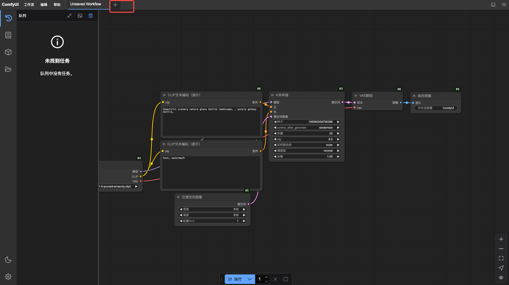
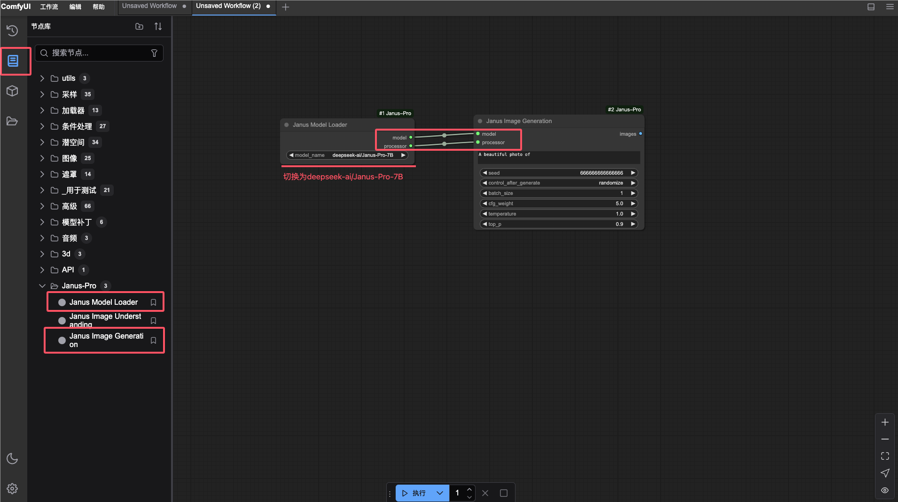
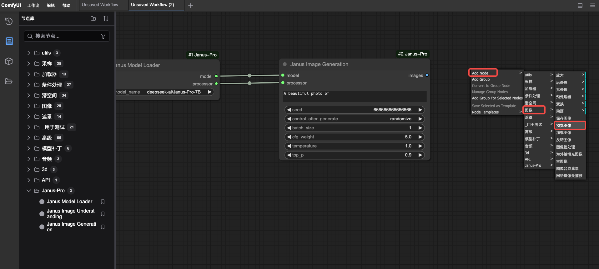
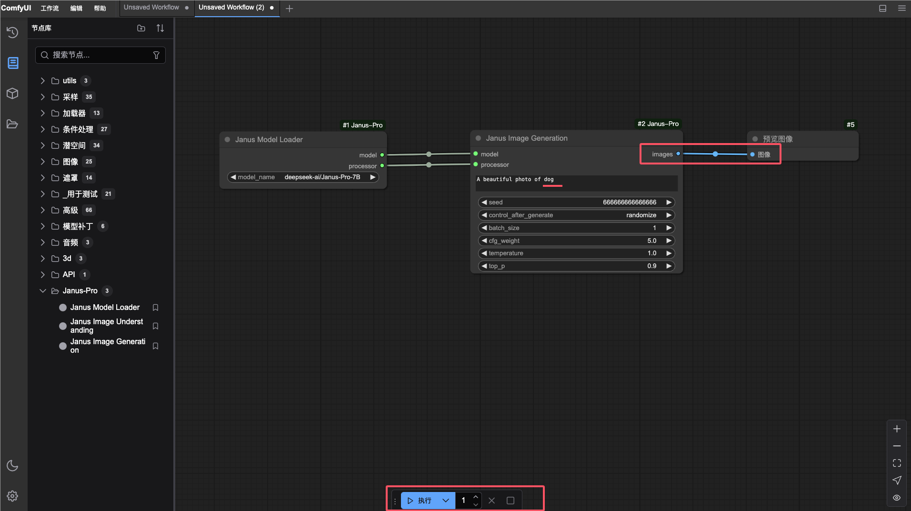

通过容器实例使用 DeepSeek

本文介绍如何在算力云模块通过容器实例直接使用 DeepSeek，以及通过 jupyter、vscode、SSH 进行算法二次开发使用。

> 算力云上线的 DeepSeek-ai/Janus-Pro-7B-ComfyUI WebUI 版文生图模型，支持 Multimodal Understanding 和 Text-to-Image Generation 两种服务，部署后可通过 **10001** **端口**直接访问并使用。

## 前提条件

- 注册并登录 Drun 平台
  
- 账户余额大于等于所选资源类型的单价
  

## 操作步骤

1. 登录 d.run 平台，选择 **算力云** 进入 **算力市场**。在上海一区选择 NVIDIA A6000 *48GB *1 、*NVIDIA L40S *48GB *1 或 NVIDIA 4090 *24GB *1  类型的 GPU资源，点击 **立即购买** ； 或切换到 **容器实例** ，点击 **创建** 按钮进行创建。
  

2. 填写实例名称，选择 DeepSeek 的镜像为 DeepSeek-ai/Janus-Pro-7B-ComfyUI。（初次使用建议初始化文件存储并挂载），点击确定后完成部署。
  

3. 刷新页面当容器实例状态为运行中时，点击访问管理，打开 **10001 端口**即可访问。

## 使用演示

1. 进入 DeepSeek Janus-Pro 界面，点击顶部操作栏 “＋”新建工作流。
  

2. 在新工作流下，点击左侧菜单栏 **节点库** ，从 Janus-Pro 文件夹中拖拽模型加载和图像生成至操作区，并修改模型 name 为 deepseek-ai/Janus-Pro-7B，连接 model 和 processor。
  

3. 在空白区域点击鼠标右键添加节点→图像→预览图像。
  

4. 连接图像，在输入框中输入 dog 后点击执行。
  

5. 运行过程中，队列处于加载状态，稍等片刻运行成功后可在队列或预览中查看生成的 dog 图片
  

  
## 通过 jupyter、vscode进行算法二次开发使用

通过 jupyter、vscode进行算法二次开发使用，可在页面上直接打开。SSH 登录提供了用户名密码和 SSH 公钥免密登录两种方式。SSH 公钥免密登录可前往个人中心导入公钥，这样重启后或新创建的实例都能免密码登录。

