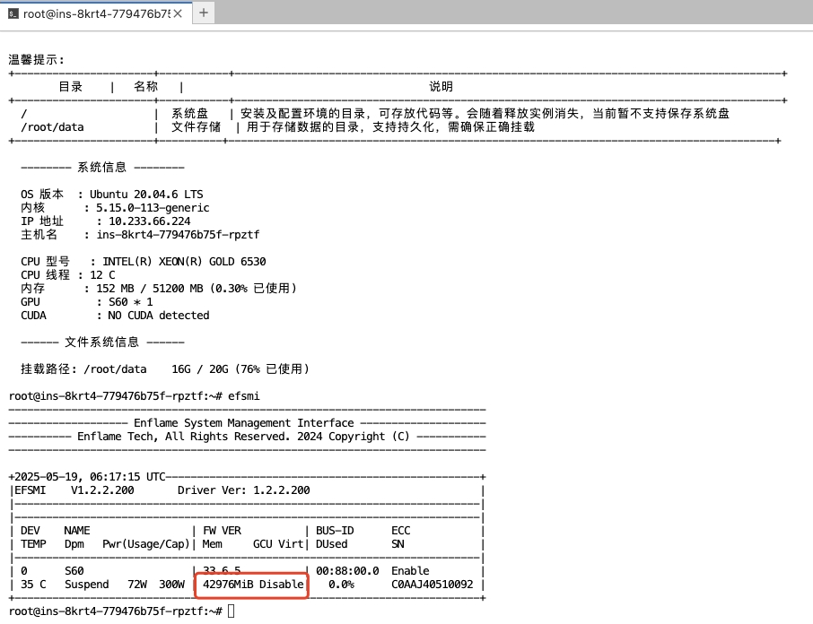
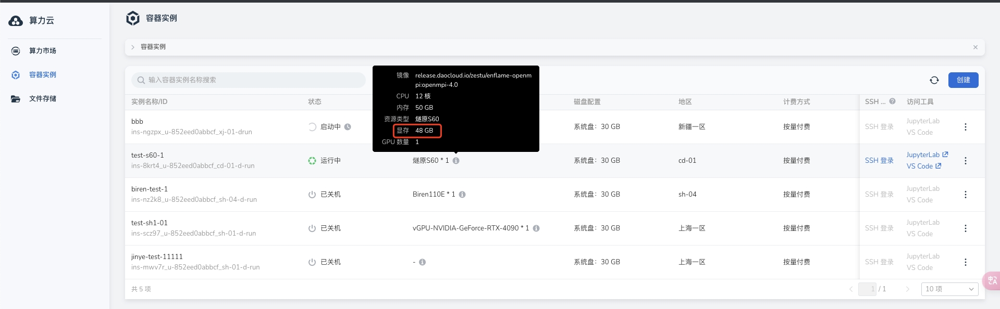

---
hide:
  - toc
---

# 算力云常见问题

本页面列出了一些在算力云（Zestu）中可能遇到的问题，为您提供便利的故障排除解决办法。

- [显存不一致的问题](#GPUMemory)

## 显存不一致的问题 <a id="GPUMemory" />

为什么 efsmi 命令输出显存和页面显示显存的规格不一致？

这是由于 GPU 卡开启了 ECC (error correcting code，错误检查和纠正) 功能，该功能可以提高数据的正确性，随之而来的是可用内存的减少和性能上的损失，故 ECC 功能导致消耗了一部分实际显存。ECC 默认在企业级显卡中开启，在消费级显卡中关闭。
