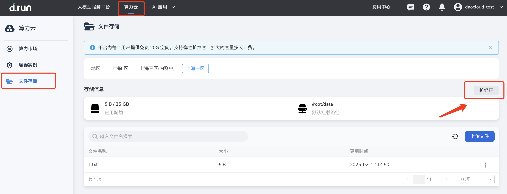
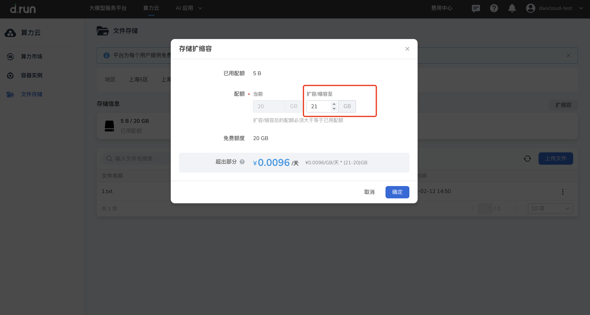

文件存储扩缩容

## 前提条件
  
- 所选地区已完成文件存储初始化。
- 账户余额大于扩容所需费用。

## 操作步骤

1. 登录 d.run，进入 **算力云** -> **文件存储** 。
  
2. 在**文件存储**页面，点击右上角的**扩缩容**。

3. 在弹出的**扩缩容**窗口中，输入**存储配额**，点击**确定**即可。

## 计费规则

1. 计费规则：超出免费容量 20 GB 的部分按天计费，不足一天则按实际使用时间扣费，精确到秒。
2. 计费时间：扩容开始计费，直到下一次扩容/缩容结束该订单。若缩容到20GB则不再计费，若扩容/缩容到其他规格则开启新订单继续计费。
3. 欠费处理：若账户余额 ＜0 ，且欠费前已扩容至付费容量（大于 20 GB），则系统将继续保存 15 天，期间继续扣费。欠费后支持手动缩容，若手动缩容至 20 GB，则不再继续扣费。若欠费超过 15 天则自动缩容至 20 GB，由于缩容造成的文件丢失无法找回，请及时充值。
4. 长时间无消费记录：若30天内未在平台产生消费记录（包括但不限于在算力云、大模型服务等任何模块产生的费用），则平台会自动删除文件存储，下次使用需要重新初始化。
