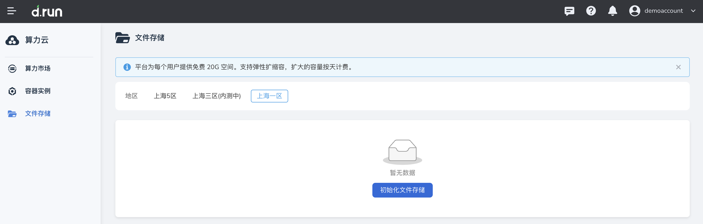
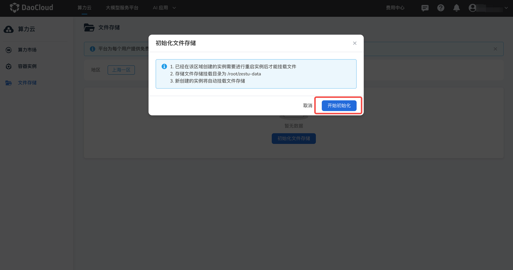
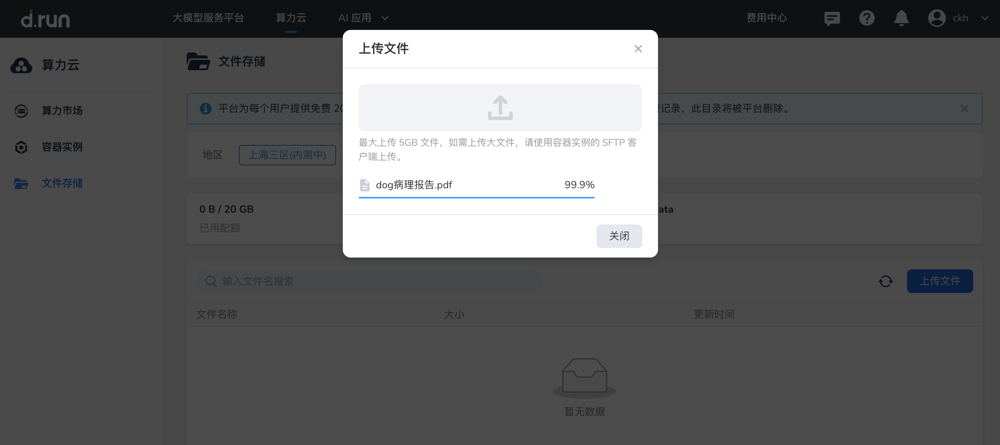

---
hide:
  - toc
---

# 初始化文件存储

文件存储主要用来存储数据、源代码等文件。可将重要文件定期上传到文件存储中。
  
!!! note

    d.run 为每个用户提供免费 20G 空间，同时支持弹性扩缩容，扩大的容量按天计费，不足一天则按实际使用时间扣费，精确到秒。

## 前提条件

- 登录您的 d.run 账号
- 账户余额 ≥ 0 元

## 操作步骤

1. 登录 d.run，进入 **算力云** -> **文件存储** ， 选择相近的区域，点击 **初始化文件存储** 开始初始化
  
    

    

2. 上传文件：点击 **上传文件** 选择本地文件进行上传。
  
    

3. 执行更多操作。

    

    - 下载文件：选择需要下载的文件，点击列表右侧的 **┇** ，在下拉列表中选择 **下载**
    - 删除文件：选择需要删除的文件，点击列表右侧的 **┇** ，在下拉列表中选择 **删除** 。删除后不可恢复，请谨慎操作！

