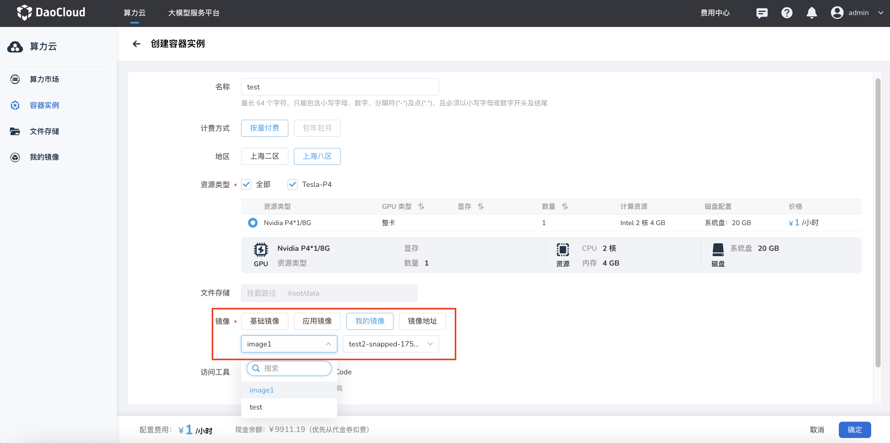

# 我的镜像

我的镜像提供了基于 Harbor 的镜像仓库服务，主要用来存储算力云中容器实例的镜像。
  
!!! note

    d.run 为每个用户提供免费的 50G 镜像空间，目前不支持扩缩容，更大配额请联系 400-002-6898。

## 前提条件

- 登录您的 d.run 账号

## 初始化镜像仓库

1. 登录 d.run，进入 **算力云** -> **我的镜像** ， 选择区域后点击 **初始化镜像仓库** 。
  
    

2. 设置镜像仓库的用户名和密码，然后点击 **开始初始化** 初始化镜像仓库。
  
    

3. 使用镜像仓库地址即可访问 Harbor 镜像仓库。

    

## 保存镜像

进入 **算力云** -> **容器实例** 列表，选择需要保存镜像的容器实例，点击列表右侧的 **┇** ，在下拉列表中选择 **保存镜像** ，填写镜像名称和 Tags 后点击 **确定** 。

- 已有镜像：选择已有镜像时，镜像将以新版本的形式存放在所选镜像的详情中。
- 新建镜像：选择新建镜像时，镜像将以新镜像的形式存放在我的镜像列表中。

## 使用镜像

点击 **算力市场** -> **立即购买** 或 **容器实例** -> **创建** 进入容器实例的创建页面，选择镜像为 **我的镜像** 即可使用镜像仓库中已保存的镜像创建容器实例。

## 删除镜像/镜像版本

1. 在 **算力云** -> **我的镜像** ，找到需要删除的镜像，在右侧操作栏选择 **删除** 按钮。
  
    

2. 在二次确认弹窗中点击 **确认** ，删除镜像的所有版本。
  
    

3. 在 **算力云** -> **我的镜像** ，点击镜像详情页，找到需要删除的镜像版本，在右侧操作栏选择 **删除** 按钮。
  
    

!!! warning

    镜像/镜像版本删除后不可恢复，请谨慎操作！
