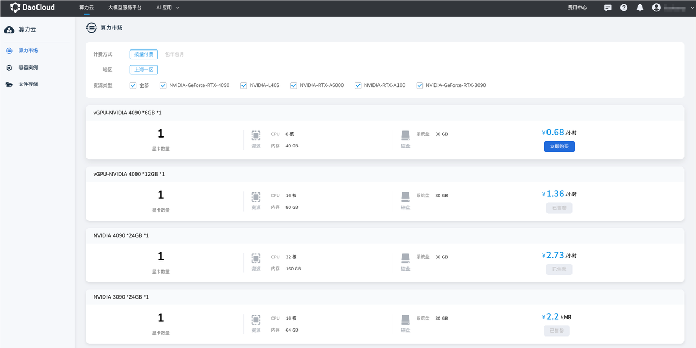

---
hide:
  - toc
---

# 算力市场

算力市场是 d.run 搭建的开放式平台，聚合来自独立算力资源供应商的多种 GPU 计算资源与配套服务。
用户可以在算力市场中按需浏览、筛选和购买不同规格的 GPU 资源，并选择合适的计费模式，
快速创建满足业务需求的容器实例，实现高效、灵活的算力获取与使用。

- 按量付费：费用 = 时长 * 单价

    时长 = 关机时间 - 开机时间，精确到秒，开机或等待过程中不计费。
    （支持按小时计费，不足一小时将按实际使用时长扣费，精确到秒）

- 包年包月：按月/年预留资源，单卡价格更优惠，租用时一次性付清
- 资源类型：GPU 的资源类型，当库存充足时可根据需求选择购买
  
点击 **立即购买** 即可前往[创建容器实例](instance.md)。

[注册并体验 d.run](https://console.d.run/){ .md-button .md-button--primary }
