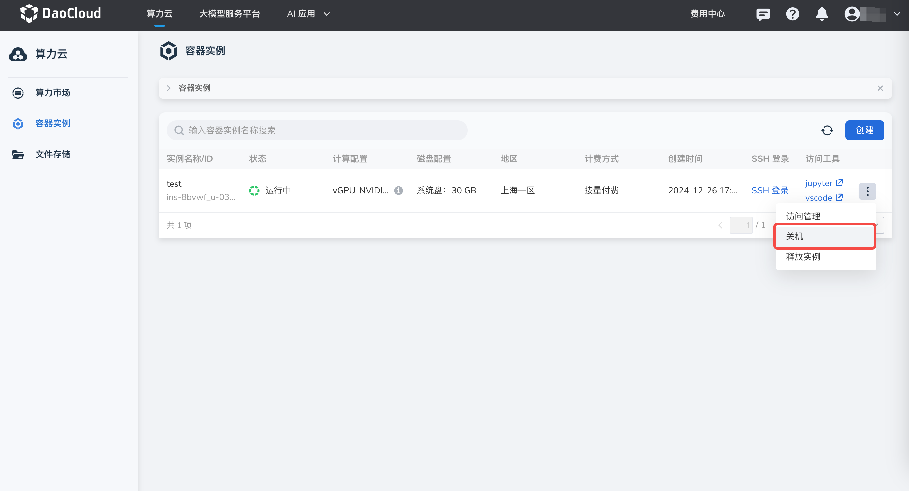
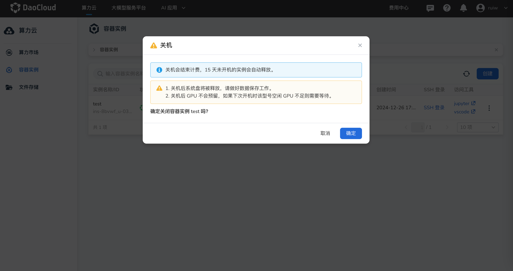
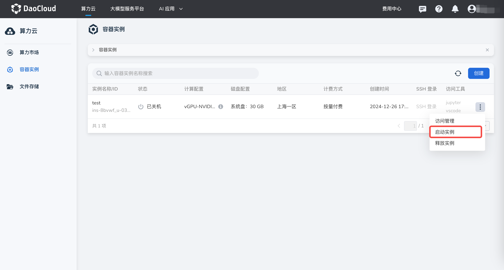
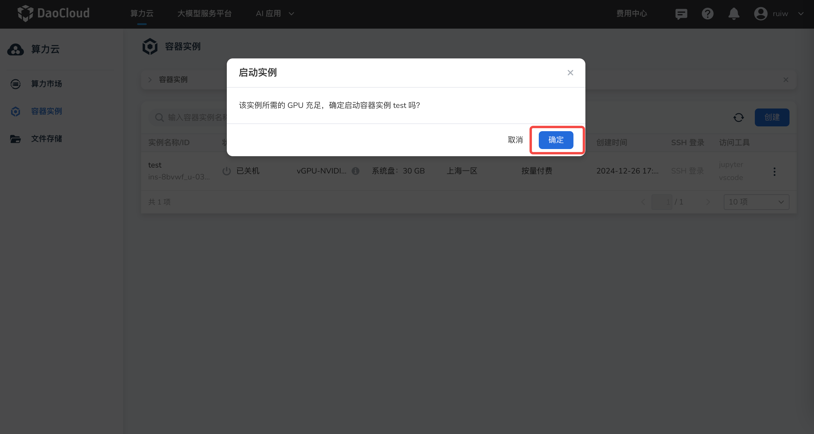

# 容器实例开关机

容器实例创建完成后，支持关机、开机操作。开机开始计费，关机停止计费。

## 关机

前提条件：已创建容器实例，且容器实例处于运行中。
  
操作步骤如下：

1. 登录 d.run，进入 **算力云** -> **容器实例** ，选择一个运行中的实例，
   点击列表右侧的 **┇** ，在下拉列表中选择 **关机**

    

1. 在弹出的提示框中，仔细阅读关机须知后，点击 **确定**

    

!!! note

    - 当前实例关机暂不支持保存系统盘，请做好数据备份。预计将在2025年2月份支持。
    - 15 天未开机的实例会自动释放。
    - 关机后 GPU 资源不会预留，如果下次开机时该型号空闲的 GPU 资源不足则需要等待。

## 开机

前提条件：已创建容器实例，且容器实例处于关机中。
  
操作步骤如下：

1. 登录 d.run，进入 **算力云** -> **容器实例** ，选择一个运行中的实例，
   点击列表右侧的 **┇** ，在下拉列表中选择 **启动实例**

    

1. 若所需的 GPU 资源充足，点击 **确定** 即可启动。资源不足时可能需要等待。

    

!!! note

    - 容器实例处于排队中或者启动中时不计费，运行状态下开始计费
    - 容器实例不会主动刷新状态，需手动刷新查看容器实例的真实状态
