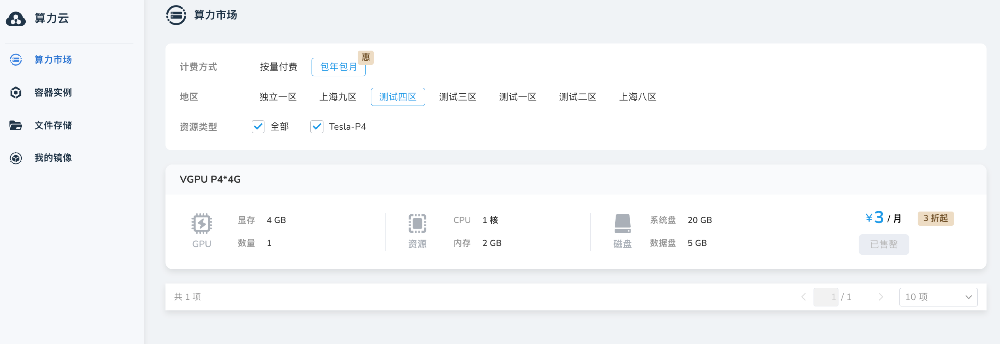
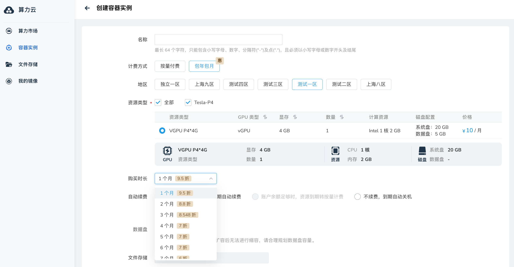
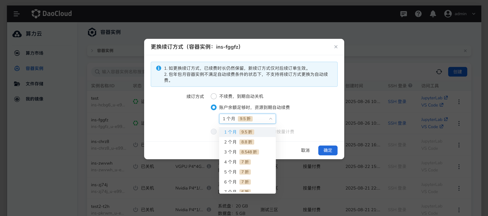
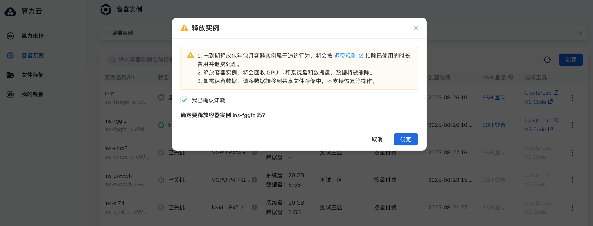

# 包年包月容器实例

包年包月容器实例是一种预付费的计算资源订购模式，为需要长期稳定算力的用户提供更具成本效益的解决方案。
通过包年包月计费方式，用户可以享受相比按量付费更优惠的价格，同时获得资源预留保障，确保所需的 GPU 算力始终可用。

包年包月模式特别适合以下场景：

- **长期项目开发**：持续进行的算法研发、模型训练等需要稳定算力支持的项目
- **生产环境部署**：需要 7x24 小时稳定运行的推理服务和应用部署
- **成本优化需求**：通过预付费方式降低长期使用成本，获得更好的资源性价比
- **资源保障要求**：确保关键业务所需的 GPU 资源得到预留，避免因资源紧张导致的业务中断

相较于按量付费模式，包年包月实例在关机状态下仍会保留 GPU 资源，用户可以随时重新启动实例而无需等待资源分配。
此外，d.run 平台还提供灵活的自动续订方式和实例管理功能，帮助用户更好地控制成本和资源使用。

## 前提条件

- 登录 d.run 账号
- 账户余额大于等于所选订阅套餐的总价
- 了解所需的 GPU 资源类型和配置要求

## 操作步骤

1. 登录 d.run 平台，选择 **算力云**，默认进入 **算力市场** ，现在已支持选择**包年包月**。
    然后选择所需 GPU 资源类型后点击 **立即购买** ；或切换到 **容器实例** ，点击 **创建** 按钮进行创建。

   

2. 在创建容器实例页面中，将 **计费方式** 选择为 **包年包月**；
    配置包年包月相关参数，并填写其他实例信息（如实例名称、地区、资源类型、镜像等），点击 **确定** 完成购买。

   

!!! note

    关于其他实例配置参数（如地区、资源类型、系统盘、文件存储、镜像、访问工具等）的详细说明，
    请参考 [创建容器实例](./instance.md) 文档。

## 配置参数说明

选择包年包月计费方式后，需要配置以下订阅相关参数：

| 参数名称 | 说明 |
| ------ | ---- |
| 购买时长 | 支持选择 1-12 个月的订阅期限。系统会根据选择的时长显示相应的折扣信息（如有）。时长越长，通常享受的折扣越大。 |
| 自动续订方式 | 支持三种到期处理方式： - **到期后自动续期（包年包月）**：到期时自动按相同计费模式续费 - **到期后自动关机**：到期时自动关闭实例，停止计费 - **到期后转按需计费**：到期时自动转换为按量付费模式 |
| 续费时长 | 当选择"到期后自动续期"时，可配置自动续费的时长，支持 1-12 个月选择。 |

!!! tip

    - 购买时长越长，享受的价格折扣通常越大，适合长期稳定使用的场景。
    - 建议根据项目周期合理选择购买时长，避免资源浪费或频繁续费。
    - 自动续订方式可在实例创建后随时修改，提供灵活的管理方式。

## 包年包月实例管理

### 修改自动续订方式

包年包月实例创建成功后，支持随时修改自动续订方式：

1. 进入 **算力云** -> **容器实例** ，找到目标实例
2. 点击实例操作菜单，选择 **更换续订方式**
3. 根据需要调整续费方式和续费时长

    

### 释放实例

包年包月实例支持提前释放，系统会自动计算退款金额：

- **退款计算**：根据剩余使用时长按比例计算退款金额
- **手续费扣除**：提前退款需要扣除一定的手续费
- **退款方式**：退款金额将自动返还到账户钱包中

   

### 关机与资源预留

包年包月实例的关机行为与按量付费实例有重要区别：

- **资源预留**：关机后 GPU 资源将继续为该实例预留，确保随时可以重新启动
- **费用计算**：关机状态下仍按订阅费用正常计费，不会停止扣费
- **快速启动**：由于资源已预留，重新开机时无需等待资源分配，可立即启动

## 续订机制

如包年包月实例的续订配置为：**到期后自动续期（包年包月）**，平台确保服务的连续性，会提前进行续费。

### 时间安排

- **提前扣费**：系统会在实例到期前 7 天开始尝试自动扣费
- **每日尝试**：从到期前 7 天开始，系统每天都会根据设置的续订方式尝试扣费
- **多次保障**：通过多次尝试机制，最大程度避免因临时余额不足导致的服务中断

### 扣费成功与失败处理

**扣费成功**：

- 按照设置的续订方式自动完成续费
- 实例继续正常运行，无需人工干预
- 系统发送续费成功通知

**扣费失败**：

- 如果连续 7 天扣费都失败，实例将在到期后自动关机
- 关机后停止计费，但会保留实例配置一段时间
- 用户充值后可手动重新启动实例（启动实例时，可以选择继续包年包月或直接转按需计费）

!!! warning

    - 包年包月实例一旦创建，订阅期内将持续计费
    - 请确保账户余额充足，避免因余额不足导致的自动关机
    - 可随时修改续订方式，灵活应对业务需求变化
    - 修改续订方式不会影响当前订阅期，仅在下次续费时生效
    - 释放实例操作不可撤销，请谨慎操作并确认数据已备份

## 注意事项

!!! note

    - 包年包月实例从创建成功时开始计费，直到订阅期满或主动释放
    - 关机状态下仍会继续计费，但保证资源预留和快速启动能力
    - 提前释放实例会按剩余时长比例退款，但需扣除相应手续费

如需更多帮助或遇到问题，请联系客服热线：**400-002-6898**
