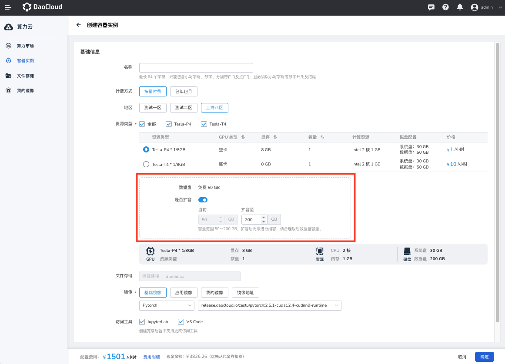

# 磁盘存储

磁盘存储为容器实例提供了基础的存储空间，磁盘分为系统盘和数据盘。

## 系统盘

系统盘是容器根文件系统存储（rootfs），d.run 为每个容器实例提供 30GB 免费容量，主要功能如下：

- 基础功能：系统盘可通过镜像的方式保存，详情可参考[保存镜像](../myimages/image-save.md)；重启后会使用保存的镜像。
- 高级功能：开发机的系统盘提供持久化存储，开发机关机、重启后仍保存开发环境和数据。开发机删除后，系统盘存储空间将被清理。（如需使用请联系管理员）

## 数据盘

数据盘是基于分布式块存储的持久化存储产品，免费容量为 50 GB。创建时自动挂载至 `/root/tmp` 路径下，具有强关联实例的生命周期，跟随实例一起创建及释放。数据盘支持付费扩容，不支持实例间的数据共享。

### 数据盘扩容

数据盘可扩容容量默认最大为 200 GB，更大配额请联系 400-002-6898。扩容后无法进行缩容，实例关机状态下不停止计费。

容器实例创建后，支持通过 **更换配置** 对数据盘进行多次扩容。
