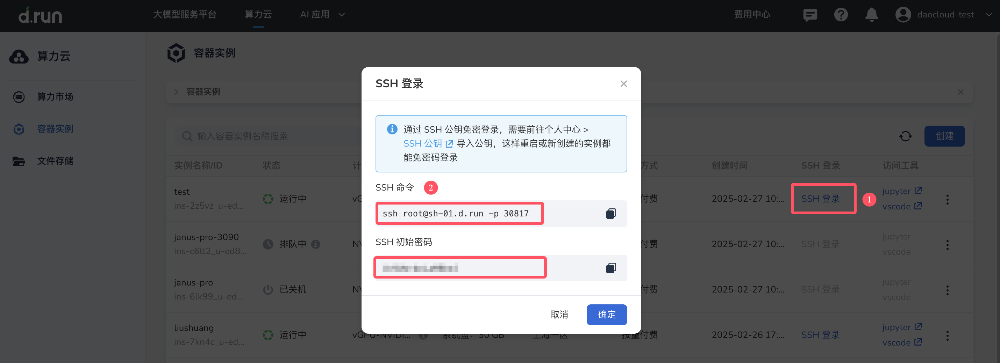
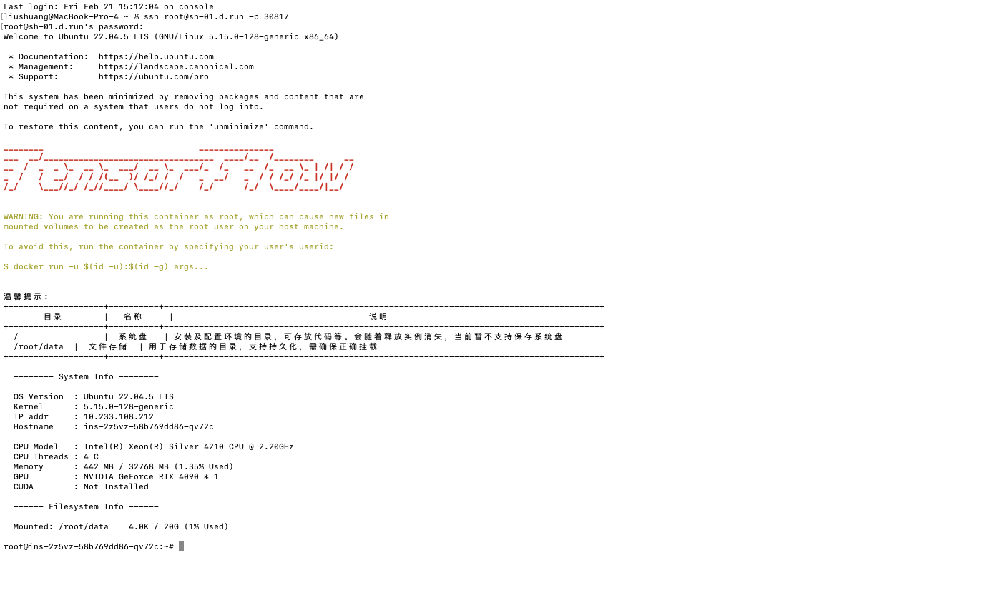
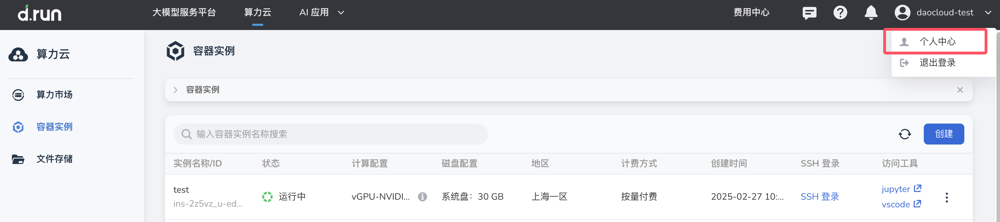
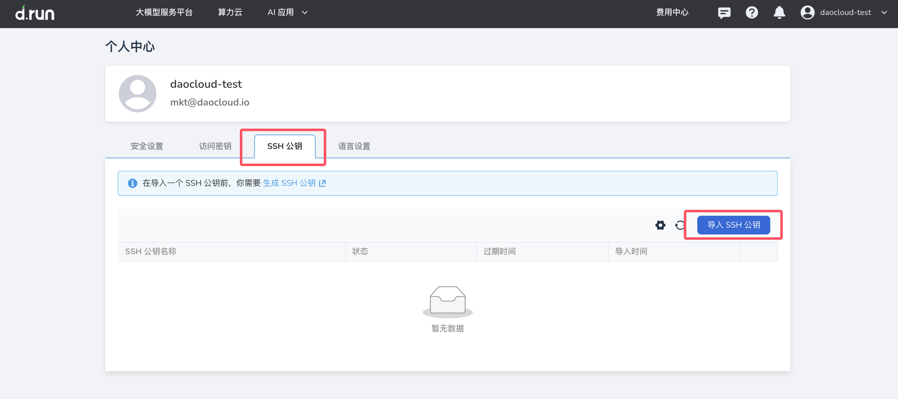
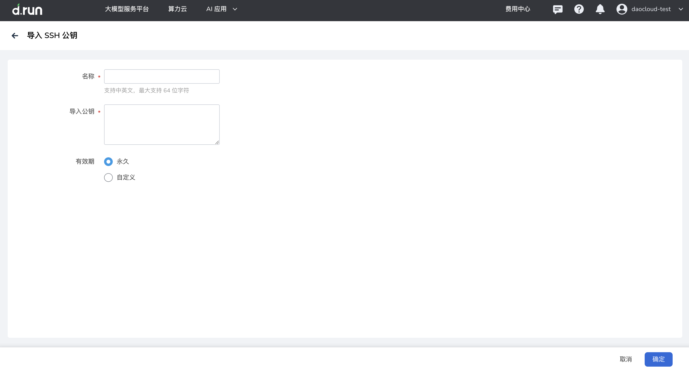

SSH  

SSH（Secure Shell）是一种网络协议，用于在不安全的网络中安全地进行远程登录和执行命令。通过SSH，用户可以从本地计算机安全地访问平台上的容器实例。

## 使用 SSH 用户名/密码登录容器实例

1. 在打开的 Terminal 终端中，安装 openssh-server 服务。

若已安装可跳过此步骤，直接进入步骤二。

① 执行如下命令，安装 openssh-server 服务。
```
apt-get update && apt install openssh-server
```
② 检查安装是否成功。

* 检查 ssh 进程。

```
ps -e | grep ssh
```

* 检查安装包。

```
dpkg -l | grep ssh
```

2. 容器启动后，在容器实例列表中点击 SSH 登录按钮，打开弹窗复制 SSH 的登录信息。



3.  在本地的 Terminal 终端中输入用户名/密码，返回如下信息表示登录成功。



## 使用 SSH 免密登录容器实例

在个人中心 >SSH 公钥 导入公钥后，重启或新创建的实例都能免密码登录容器实例。

### 步骤一：配置 SSH 公钥

在生成新的 SSH 密钥前，请先确认是否需要使用本地已生成的 SSH 密钥，SSH 密钥对一般存放在本地用户的根目录下。 Linux、Mac 请直接使用以下命令查看已存在的公钥，Windows 用户在 WSL（需要 Windows 10 或以上）或 Git Bash 下使用以下命令查看已生成的公钥。

- **ED25519 算法：**

    ```bash
    cat ~/.ssh/id_ed25519.pub
    ```

- **RSA 算法：**

    ```bash
    cat ~/.ssh/id_rsa.pub
    ```

如果返回一长串以 ssh-ed25519 或 ssh-rsa 开头的字符串，说明已存在本地公钥，
您可以跳过[步骤 2 生成 SSH 密钥](#2-ssh)，直接操作[步骤 3](#3)。

### 步骤二：生成 SSH 密钥

若[步骤 1](#1-ssh) 未返回指定的内容字符串，表示本地暂无可用 SSH 密钥，需要生成新的 SSH 密钥，请按如下步骤操作：

1. 访问终端（Windows 请使用 [WSL](https://docs.microsoft.com/zh-cn/windows/wsl/install) 或 [Git Bash](https://gitforwindows.org/)），
   运行 `ssh-keygen -t`。
  
2. 输入密钥算法类型和可选的注释。
  
    注释会出现在 .pub 文件中，一般可使用邮箱作为注释内容。
    
    - 基于 `ED25519` 算法，生成密钥对命令如下：
    
        ```bash
        ssh-keygen -t ed25519 -C "<注释内容>"
        ```
    
    - 基于 `RSA` 算法，生成密钥对命令如下：
    
        ```bash
        ssh-keygen -t rsa -C "<注释内容>"
        ```

3. 点击回车，选择 SSH 密钥生成路径。

    以 ED25519 算法为例，默认路径如下：
    
    ```console
    Generating public/private ed25519 key pair.
    Enter file in which to save the key (/home/user/.ssh/id_ed25519):
    ```
    
    密钥默认生成路径：`/home/user/.ssh/id_ed25519`，公钥与之对应为：`/home/user/.ssh/id_ed25519.pub`。

4. 设置一个密钥口令。

    ```console
    Enter passphrase (empty for no passphrase):
    Enter same passphrase again:
    ```

    口令默认为空，您可以选择使用口令保护私钥文件。
    如果您不想在每次使用 SSH 协议访问仓库时，都要输入用于保护私钥文件的口令，可以在创建密钥时，输入空口令。

5. 点击回车，完成密钥对创建。

### 步骤三：拷贝公钥

除了在命令行打印出已生成的公钥信息手动复制外，可以使用命令拷贝公钥到粘贴板下，请参考操作系统使用以下命令进行拷贝。

- Windows（在 [WSL](https://docs.microsoft.com/en-us/windows/wsl/install) 或 [Git Bash](https://gitforwindows.org/) 下）：

    ```bash
    cat ~/.ssh/id_ed25519.pub | clip
    ```

- Mac：

    ```bash
    tr -d '\n'< ~/.ssh/id_ed25519.pub | pbcopy
    ```

- GNU/Linux (requires xclip):

    ```bash
    xclip -sel clip < ~/.ssh/id_ed25519.pub
    ```

### 步骤四：在平台上设置公钥

1. 登录 Drun UI 页面，在页面右上角选择 **个人中心** -> **SSH 公钥** 。



  
2. 添加生成的 SSH 公钥信息。






* 公钥标题：支持自定义公钥名称，用于区分管理。
* 过期时间：设置公钥过期时间，到期后公钥将自动失效，不可使用；如果不设置，则永久有效。

