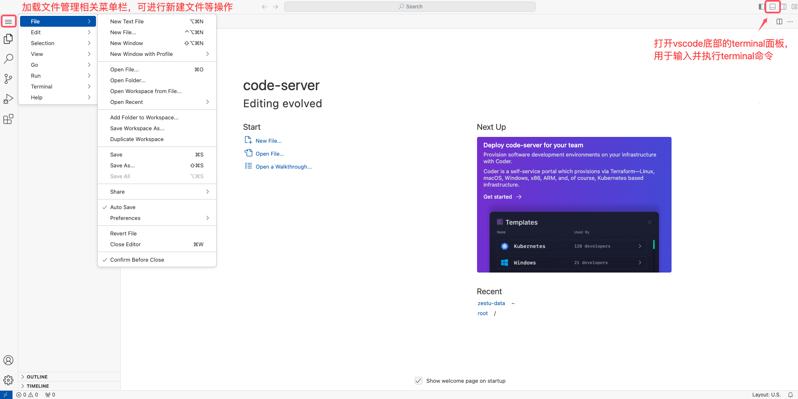
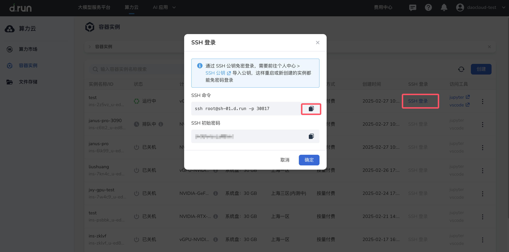
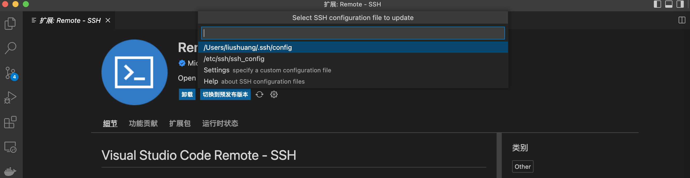
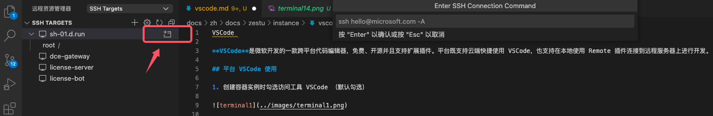
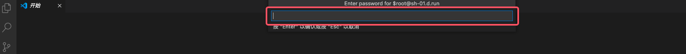
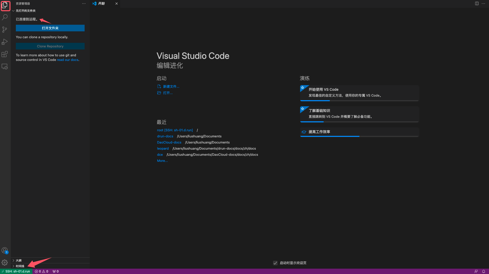

# VS Code

**VS Code** 是微软开发的一款跨平台代码编辑器，免费、开源并且支持扩展插件。
平台既支持云端快捷使用 VS Code，也支持在本地使用 Remote 插件连接到远程服务器上进行开发。

## 在 d.run 上使用 VS Code

1. 创建容器实例时勾选访问工具 VS Code （默认勾选）

    

2. 容器启动后，在容器实例列表中点击快捷访问链接打开 VS Code

    

3. 进入 VS Code UI 页面，点击右上角 **Toggle Panel** ，可打开 VS Code 底部的 Terminal 面板，用于输入并执行 Terminal 命令。左侧相关菜单栏，可进行 **新建文件** 等操作。

    

4. 在左侧导航栏中，点击 **扩展** ，进入扩展列表，用户可根据实际需要安装相应扩展组件。
   在扩展列表中，选择待安装的组件（以 Python 扩展为例），打开其介绍页面，点击 **Install** ，等待组件安装完成即可。

    

## 本地 VS Code 使用

1. 本地 VS Code 配置 Remote-SSH

    !!! note

        如果您本地 VS Code 开发工具已安装 Remote-SSH，可跳过此步骤，直接参考[下一步](#step2)

    打开本地的 VS Code 开发插件菜单，在扩展程序中搜素 `Remote-SSH` 并安装：

    

2. SSH 连接并登录您平台上租用的实例 

    按照 ① ② ③ 顺序进行点击，完成添加 SSH 主机

    

    

3. 复制并获取您实例的登录信息 

    

4. 下图以 `ssh root@sh-01.d.run -p 30817` 为例。回车键继续操作。

    

    远程主机信息会保存在本地配置文件中，选择第 1 个配置文件完成添加。

    

5. 连接远程主机

    添加完成后在 **远程资源管理器** 中显示刚添加的远程主机。点击在新窗口中打开连接的按钮。

    

6. 复制并获取实例的登录密码，参考[步骤 3](#step3) 粘贴复制的登录密码后敲击回车键。

    

7. 成功连接后点击 **资源管理器** 标签会显示已连接到远程。同时左下角提示已连接的远程主机名称。

    
