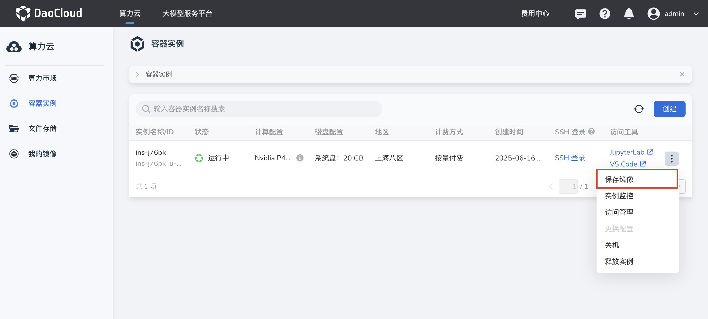
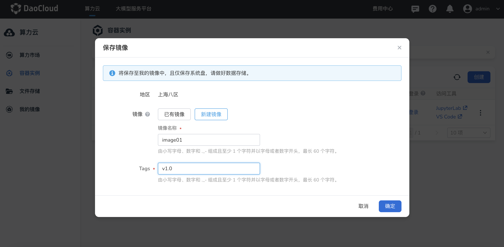
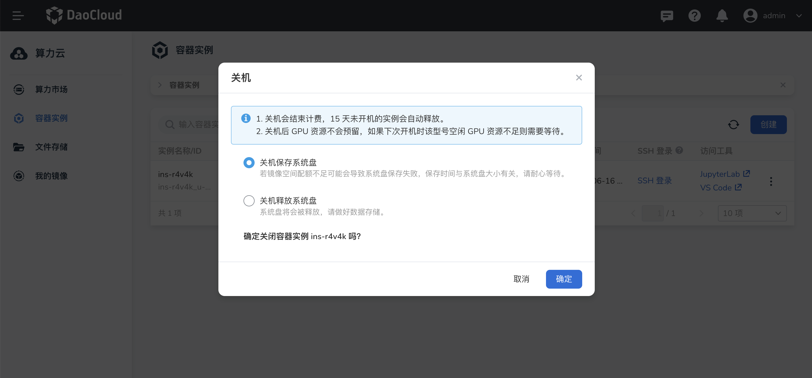

# 保存镜像

本文介绍在 d.run 中如何保存容器实例系统盘至 **我的镜像** ，主要有手动保存、关机保存、定时关机自动保存及欠费自动保存共四种方式。
  
## 前提条件

- 所选地区已完成镜像仓库初始化
- 镜像空间配额充足

## 手动保存镜像

进入 **算力云** -> **容器实例** 列表，选择需要保存镜像的容器实例，点击列表右侧的 **┇** ，在下拉列表中选择 **保存镜像** ，填写镜像名称和 Tags 后点击 **确定** 。

- 已有镜像：选择已有镜像时，镜像将以新版本的形式存放在所选镜像的详情中。
- 新建镜像：选择新建镜像时，镜像将以新镜像的形式存放在我的镜像列表中。

## 关机保存镜像

对容器实例执行关机操作时，选择 **关机保存系统盘** 保存镜像。

## 自动保存镜像

当容器实例 **定时关机** 或因欠费关机时，平台将为用户自动保存系统盘至 **我的镜像** 。

!!! warning

    镜像空间配额不足时将会导致系统盘保存失败，数据丢失，请确保配额充足！