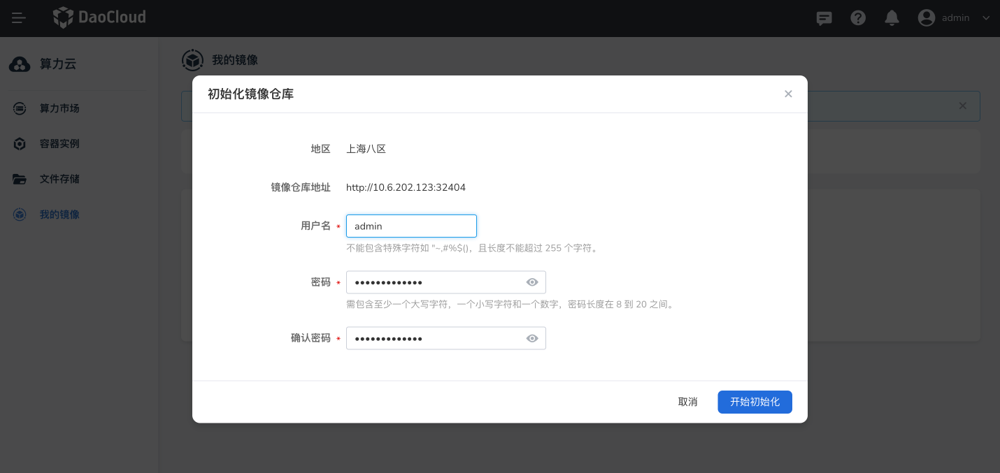
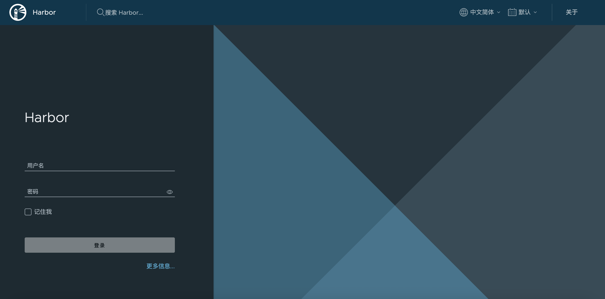
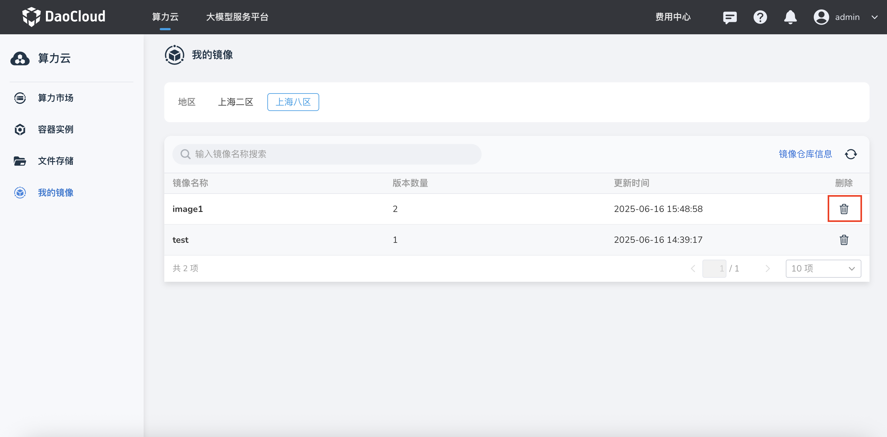

# 我的镜像

**我的镜像** 是基于 Harbor 构建的 **专属镜像仓库服务** ，用于集中存储和管理用户的自定义镜像。  
它支持将容器实例的系统盘内容打包为镜像并保存至仓库，不仅能有效防止因实例重建、意外删除或硬件故障导致的数据丢失，
还能在需要时 **一键复用** ，快速创建相同环境的容器实例。

通过“我的镜像”，用户可以：

- 持久化保存容器运行环境及配置，便于跨项目或跨环境复用
- 快速分发和部署镜像，提高开发与运维效率
- 配合版本管理，追踪环境变更历史，便于回滚与调试

!!! note

    d.run 为每位用户默认提供 **50 GB 免费镜像空间** ，如需更大配额，请联系 **400-002-6898** 申请扩容。

## 前提条件

- 登录您的 d.run 账号

## 初始化镜像仓库

1. 登录 d.run，进入 **算力云** -> **我的镜像** ， 选择区域后点击 **初始化镜像仓库** 。
  
    

2. 设置镜像仓库的用户名和密码，然后点击 **开始初始化** 初始化镜像仓库。
  
    

3. 使用镜像仓库地址即可访问 Harbor 镜像仓库。

    

## 使用镜像

点击 **算力市场** -> **立即购买** 或 **容器实例** -> **创建** 进入容器实例的创建页面，
选择镜像为 **我的镜像** 即可使用镜像仓库中已保存的镜像创建容器实例。

## 删除镜像/镜像版本

1. 在 **算力云** -> **我的镜像** ，找到需要删除的镜像，在右侧操作栏选择 **删除** 按钮。
  
    

2. 在二次确认弹窗中点击 **确认** ，删除镜像的所有版本。
  
    

3. 在 **算力云** -> **我的镜像** ，点击镜像详情页，找到需要删除的镜像版本，在右侧操作栏选择 **删除** 按钮。
  
    

    !!! warning

        镜像/镜像版本删除后不可恢复，请谨慎操作！
